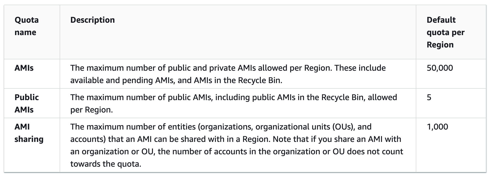

# Amazon Machine Images (AMI)
An Amazon Machine Image (AMI) is a supported and maintained image provided by AWS that provides the information required to launch an instance. **You must specify an AMI when you launch an instance.**
An AMI includes:
  - Amazon Elastic Block Store (Amazon EBS) snapshots or a template for the root volume of the instance (for instance-store-backed AMIs).
  - Launch permissions that control which AWS accounts can use the AMI to launch instances.
  - A block device mapping that specifies the volumes to attach to the instance when it's launched.

## AMI life circle

You can **search** for an AMI that meets the criteria for your instance (or **create** and **register** it) and use it to **launch new instances**. You can **copy** an AMI within the same AWS Region or to different AWS Regions. When you no longer require an AMI, you can **deregister** it.
After you create an AMI, you can keep it private so that only you can use it, or you can **share** it with a specified list of AWS accounts.

## AMI types
You can select an AMI to use based on the following characteristics: Region, Operating system, Architecture (32-bit or 64-bit), Launch permissions, Storage for the root device

### Launch permissions
The owner of an AMI determines its availability by specifying launch permissions
  - **public**: The owner grants launch permissions to all AWS accounts
  - **explicit**: The owner grants launch permissions to specific AWS accounts, organizations, or organizational units (OUs).
  - **implicit**: The owner has implicit launch permissions for an AMI
Amazon community provides a large selection of [public AMIs](https://docs.aws.amazon.com/AWSEC2/latest/UserGuide/sharing-amis.html) or [AMI with fees](https://docs.aws.amazon.com/AWSEC2/latest/UserGuide/paid-amis.html)

### Storage for the root device
All AMIs are categorized as either backed by Amazon EBS or backed by instance store.

|                          | Amazon EBS-backed AMI	 | Amazon instance store-backed AMI |
|--------------------------| ---------------------- | -------------------------------  |
| Boot time for an instance | Usually less than 1 minute|Usually less than 5 minutes|
| Size limit for a root device | 64 TiB | 10 GiB|
| Root device volume | EBS volume | Instance store volume |
| Data persistence | By default, the root volume is deleted when the instance terminates. Data on any other EBS volumes persists after instance termination by default | Data on any instance store volumes persists only during the life of the instance |
| Modifications | The instance type, kernel, RAM disk, and user data can be changed while the instance is stopped. | Instance attributes are fixed for the life of an instance. |
| Charges | You're charged for instance usage, EBS volume usage, and storing your AMI as an EBS snapshot. | You're charged for instance usage and storing your AMI in Amazon S3. |
| AMI creation/bundling | Uses a single command/call | Requires installation and use of AMI tools|
| Stopped state | Can be in a stopped state. Even when the instance is stopped and not running, the root volume is persisted in Amazon EBS | Cannot be in a stopped state; instances are running or terminated |

**Amazon EBS-backed AMI** or **Amazon instance store-backed AMI?**
  > You can choose between AMIs backed by Amazon EC2 instance store and AMIs backed by Amazon EBS. We recommend that you use AMIs backed by Amazon EBS, because they launch faster and use persistent storage.

## Virtualization types
Linux Amazon Machine Images use one of two types of virtualization: **paravirtual (PV)** or **hardware virtual machine (HVM)**. The main differences between PV and HVM AMIs are the way in which they boot and whether they can take advantage of special hardware extensions (CPU, network, and storage) for better performance.
| | HVM | PV|
|-|--|--|
| Support for hardware extensions	 | Yes | No |
|Supported instance types	| All current generation instance types support HVM AMIs | The following previous generation instance types support PV AMIs: C1, C3, HS1, M1, M3, M2, and T1. Current generation instance types do not support PV AMIs |
| Supported Regions	| All Regions support HVM instances. | Asia Pacific (Tokyo), Asia Pacific (Singapore), Asia Pacific (Sydney), Europe (Frankfurt), Europe (Ireland), South America (São Paulo), US East (N. Virginia), US West (N. California), and US West (Oregon) |

## Boot modes
In EC2, two variants of the boot mode software are supported: **Unified Extensible Firmware Interface (UEFI)** and **Legacy BIOS**. By default, Graviton instance types run on **UEFI**, and Intel and AMD instance types run on **Legacy BIOS**.
The AMI boot mode parameter is optional. An AMI can have one of the following boot mode parameter values: uefi or legacy-bios. For AMIs with no boot mode parameter, the instances launched from these AMIs use the default value of the instance type— **uefi** on Graviton, and **legacy-bios** on all Intel and AMD instance types.

### UEFI Secure Boot
Secure Boot is a UEFI firmware security feature developed by the UEFI Consortium that ensures only immutable and signed software are loaded during the boot time. Secure Boot leverages digital signatures to validate the authenticity, source, and integrity of the code that is loaded.
The chain of trust is as follows:
  - Platform key (PK) database
  - Key exchange key (KEK) database
  - Signature (db) database
  - Signature denylist (dbx) database
For more understand about Security Boot, you can read [this article](https://edk2-docs.gitbook.io/understanding-the-uefi-secure-boot-chain/secure_boot_chain_in_uefi/uefi_secure_boot)

## Shared AMIs
A shared AMI is an AMI that a developer created and made available for others to use. You use a shared AMI at your own risk. Amazon can't vouch for the integrity or security of AMIs shared by other Amazon EC2 users. In the Amazon EC2 console, public AMIs that are owned by Amazon or a verified Amazon partner are marked **Verified provider**.
Shared AMI can be a **public** AMI, **share with specific organizations** or share with **specific AWS accounts**.

#### Considerations for make an AMI public:
  - **Ownership** – To make an AMI public, your AWS account must own the AMI
  - **Some AMIs can't be made public** if your AMI includes one of the following components: **Encrypted volumes**, **Snapshots of encrypted volumes**, **Product codes**
  - **Avoid exposing sensitive data**: follow [the recommended actions](https://docs.aws.amazon.com/AWSEC2/latest/UserGuide/building-shared-amis.html)
  - **Region**: AMIs are a Regional resource. When you share an AMI, it is available only in the Region from which you shared it.
  - **Usage**: When you share an AMI, users can only launch instances from the AMI. They can’t delete, share, or modify it.
  - **Automatic deprecation**: By default, the deprecation date of all public AMIs is set to two years from the AMI creation date. You can set the deprecation date to earlier than two years.

You can read more about [Share an AMI with specific organizations or organizational units](https://docs.aws.amazon.com/AWSEC2/latest/UserGuide/share-amis-with-organizations-and-OUs.html) and [Share an AMI with specific AWS accounts](https://docs.aws.amazon.com/AWSEC2/latest/UserGuide/sharingamis-explicit.html).

## Paid AMIs
A paid AMI is an AMI that you can purchase from a developer. Amazon EC2 integrates with AWS Marketplace, enabling developers to charge other Amazon EC2 users for the use of their AMIs or to provide support for instances. Launching an instance from a paid AMI is the same as launching an instance from any other AMI. No additional parameters are required. The instance is charged according to the rates set by the owner of the AMI.

## AMI quotas

If you need more than the default quota for AMIs, you can request a quota increase. For more information, you can check [this guide](https://docs.aws.amazon.com/servicequotas/latest/userguide/request-quota-increase.html).

