# Amazon Machine Image - Practices
In this practice, we just work Amazon EBS-backed AMIs, you can read more about instance store-backed AMI by this [link](https://docs.aws.amazon.com/AWSEC2/latest/UserGuide/creating-an-ami-instance-store.html).

The following diagram summarizes the process for creating an Amazon EBS-backed AMI from a running EC2 instance:

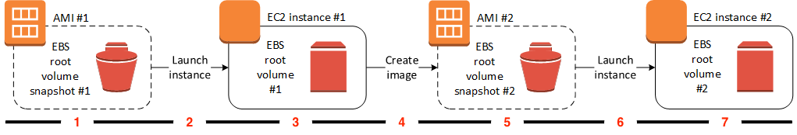

Let's enjoy it step by step!
## Launch an instance

### Find an AMI
When we launch an EC2 instance, we need to choose an AMI
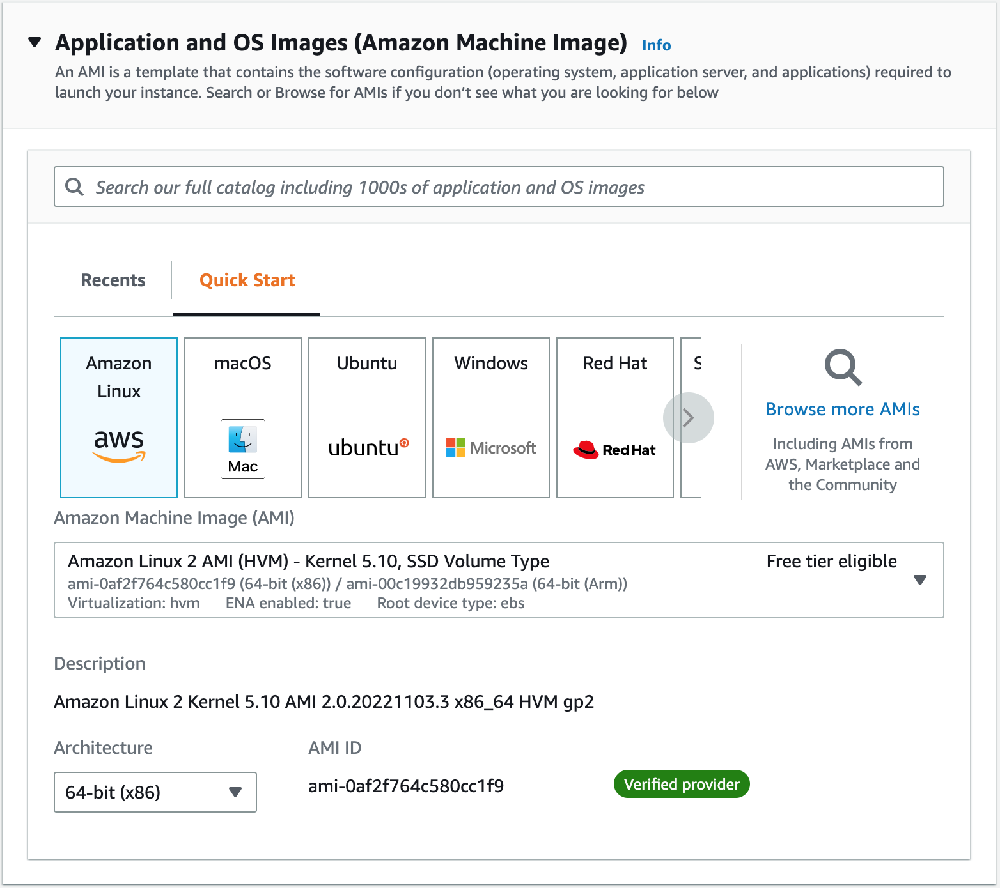

You can choose AMI from Quick Start list or Recents list. Or you can search AMI by enter your keyworks in search box and enter. In this example, I choose AMI with the '**ruby**' keyword, architecture is **64-bit (x86)**, root device type is **EBS**.
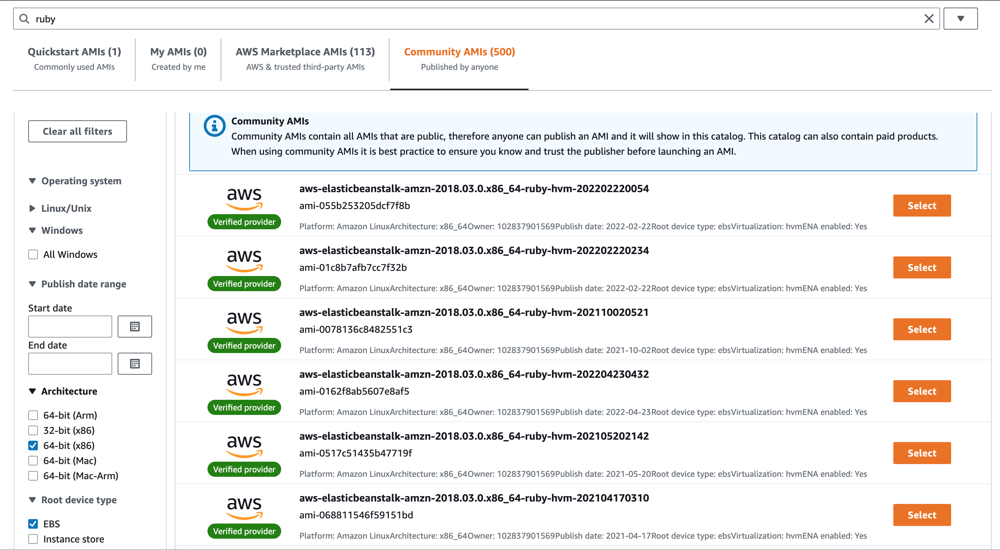

I select the first one.
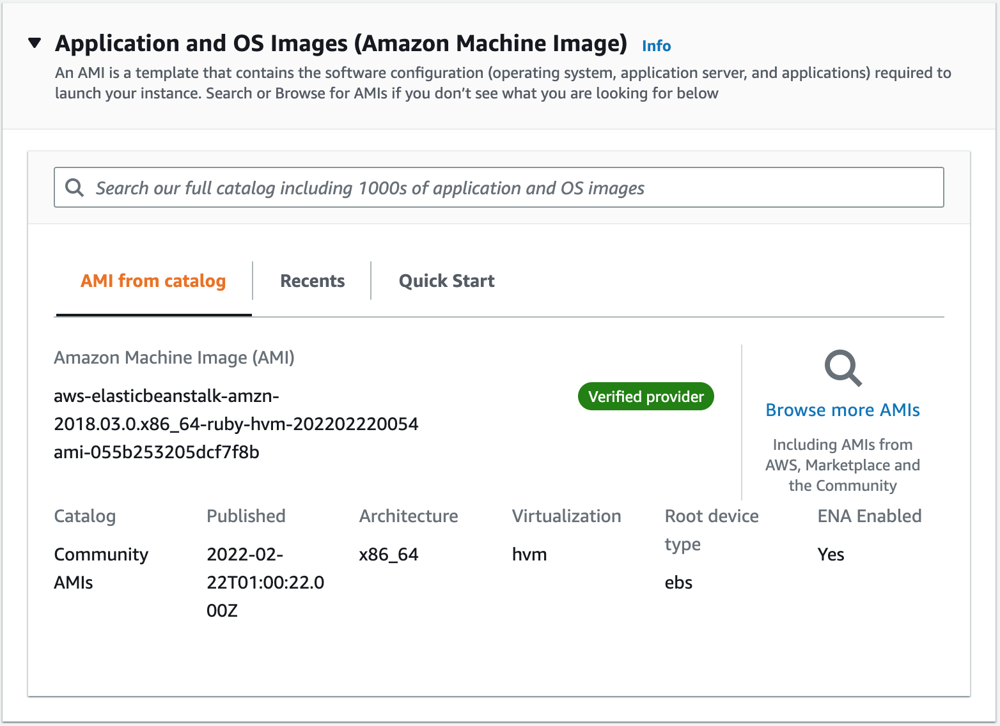

Complete other setup to launch the instance. And we will have an instance with Ruby installed.
Let's SSH to instance and check it!
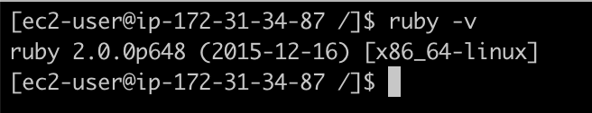
### Customize the instance
We will install some packages or frameworks that we use ofen.
In this example, I will install ```git```, ```Rails```, ```rbenv```
> sudo yum install git
> gem install rails

Rails can't be installed with current Ruby version!
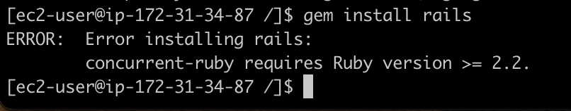

I use this [tutorial](https://www.linkedin.com/pulse/how-install-ruby-centos-7-amal-krishna-r/?trk=public_profile_article_view) to install ```rbenv``` - a version manager tool for Ruby.
And we use ```rbenv``` to install ```ruby``` with a newer version
> rbenv install 2.7.7
> rbenv global 2.7.7

Re-install Rails - it will be success!
> gem install rails

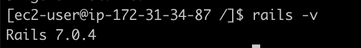

Now, our instance has ```git, rbenv, ruby, rails```.

### Create AMI
**Notes**: 
  - When you create an AMI from an instance, **Amazon EC2 powers down the instance** before creating the AMI to ensure that everything on the instance is stopped and in a consistent state during the creation process.
  - During the AMI-creation process, Amazon EC2 creates snapshots of your instance's root volume and any other EBS volumes attached to your instance. **You're charged for the snapshots until you deregister the AMI and delete the snapshots**
  - You also can create AMI from a snapshot [this tutorial](https://docs.aws.amazon.com/AWSEC2/latest/UserGuide/creating-an-ami-ebs.html#creating-launching-ami-from-snapshot)

On EC2 instance console, click on **Create image**
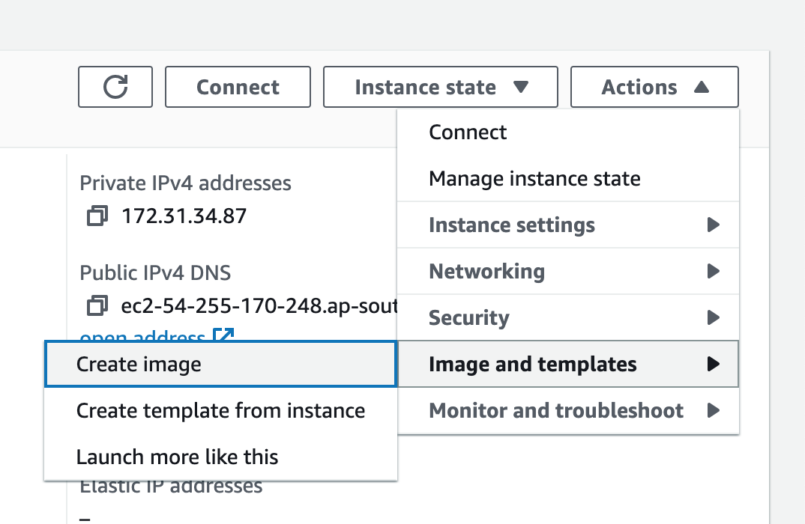

Enter your **image name** and other fields, then click **Create**.
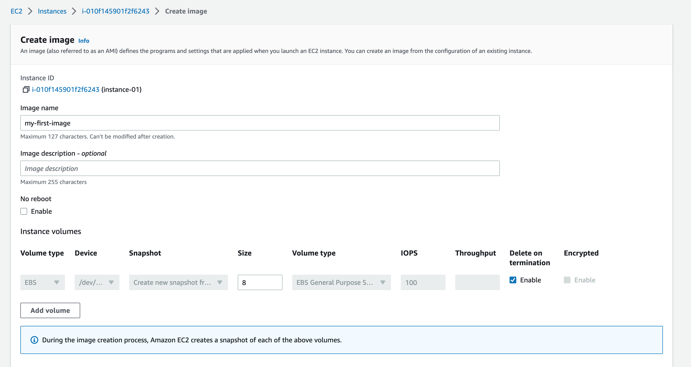

With **No boot** option, if you **enable**, your Amazon EC2 will not reboot. In this example, I leave it default so my instance will be reboot.
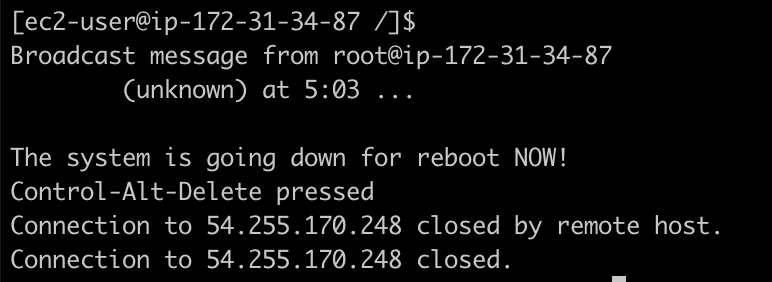

Our AMI:
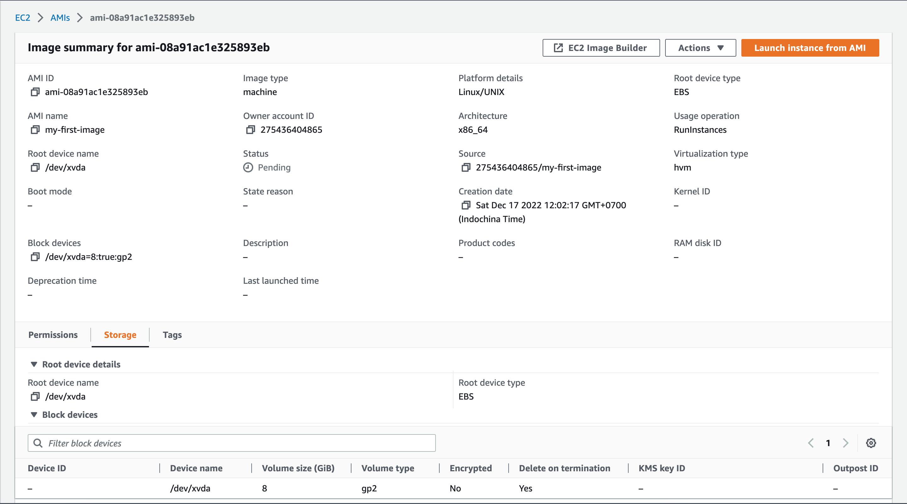

### Launch new instance from AMI
You can click on **Launch instance from AMI** from that AMI details or launch instance as normal and at select AMI step, just select that AMI.

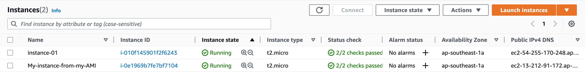

We SSH to the new instance and check all packages that we installed.


