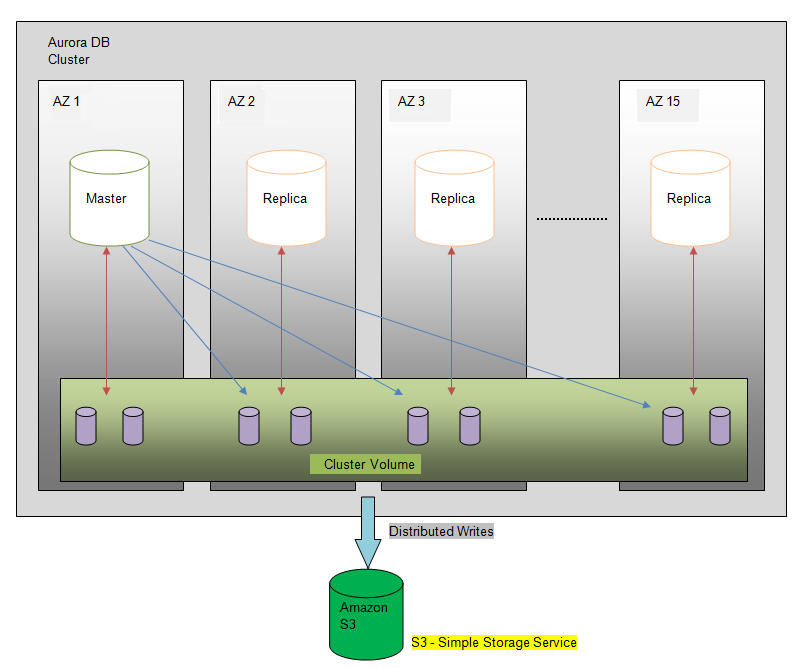

# Introduction about Aurora
In today's age, almost all applications are getting a bigger and bigger userbase, and serving more users means you need more optimized application. Optimization of applications has some limitations, and after some level, it's not possible without enhancing/changing the application architecture. Most existing applications use relational databases, which are meant for monolithic architecture. This monolithic architecture and SQL queries are making them slow. It doesn't matter how good and robust of a query you are writing; it has some certain threshold to deal with and will die afterward.

So, the million dollar question: Without changing the existing application's architecture, how can we improve our application's performance? The answer is **AWS Aurora**.

Amazon's definition is:

>"AWS Aurora is a MySQL compatible, enterprise-grade relational database engine built for the cloud. With respect to database migrations, the focus is changing from a “lift and shift” approach to migrating (that is, migrating as-is and running databases on virtual servers in the cloud) to fully managed, cloud-native database services like Amazon Aurora. One of the key objectives of Amazon Aurora is to overcome the performance, scalability, and availability limitations of traditional databases in a cost-effective manner similar to open-source databases. Amazon Aurora provides up to five times better performance than MySQL at a price point one-tenth that of a commercial database while delivering similar performance and availability."

Let's take a deep dive into what AWS Aurora is and how it could help you and your application.

### Table of content
1. Architecture
2. Features of Aurora

## Architecture
Whenever we create an Aurora instance, we create a **DB cluster**. A DB cluster consists of one **primary instance** and one **cluster volume**; additionally, we can create an Aurora replica. It does continuous backups to AWS S3 (Simple Storage Service) to maintain 99.999999999% durability. 

Aurora starts with a 80GB blocks assigned to the instance and allocates 10GB blocks as part of auto-scaling.

**Primary instance**:
- Supports read/write workloads.
- Performs all of the data modifications to the cluster volume.

**Cluster volume**:
- SSD virtual database storage volume.
- Supports multiple Availability zones (AZ).
- Each AZ has two copies of cluster data.
- Getting shared by primary instance and aurora replica.

**Aurora replica**:
- Supports read-only operations.
- The maximum number of replicas could be 15.
- Multiple Aurora replicas to support the distribution of read workloads.
- Multiple Aurora replicas mean increased database availability.
- If a primary instance fails, one of the Aurora replicas will be promoted as primary instance.

Let's look at a diagram that depicts this:

## Features of Amazon Aurora
There are many features of Amazon Aurora. Some of those features are:

**Fully managed**
RDS fully manages Aurora. The user no longer has to be concerned about database management tasks such as hardware provisioning or backups. Aurora subsequently and constantly screens and backs up the database to Amazon S3. This enables precise point-in-time recovery.

**Migration support**
Amazon Aurora’s MySQL and PostgreSQL compatibility makes it a compelling choice for database migrations to the cloud. Users who want to move from MySQL can find a list of tools and options in the migration documentation. The user can use the AWS Database Migration Service to migrate from commercial database engines for a safe and minimally impacted migration.

**Security**
Aurora, among other things, provides various levels of protection to the database to improve it. During an encoded Amazon Aurora occurrence, data in the underlying storage gets encrypted. For administration, you can use Key Management Service(KMS) and use SSL for data encryption in transit. There are also automatic reinforcements, snapshots, and replications within the same cluster.

**Performance and expandability**
AWS Aurora has five times the throughput of regular MySQL. This performance is comparable to enterprise databases but at a fraction of the cost. The user can scale database preparation up to and down for smaller to larger instance varieties according to the user’s needs. The user can scale scan capacity and performance by adding up to fifteen low latency scan replicas spread across three convenience Zones.

**Accessibility and serviceability**
Built for the cloud, AWS Aurora includes fault-tolerant and self-healing storage. It has a remarkable 99.99 percent accessibility. The cloud storage replicates the six copies of information across 3 Availability Zones. AWS Aurora continuously backs up data for safety and as a precaution against storage failure.

**Compatibility with MySQL and PostgreSQL**
The Amazon Aurora database engine is fully compatible with existing MySQL and PostgreSQL open source databases. And compatibility for new releases is added regularly. This means the user can use standard MySQL or PostgreSQL tools or previews to migrate MySQL or PostgreSQL databases to Aurora. It also implies that users who use code, applications, drivers, and tools with existing databases can also use it.

