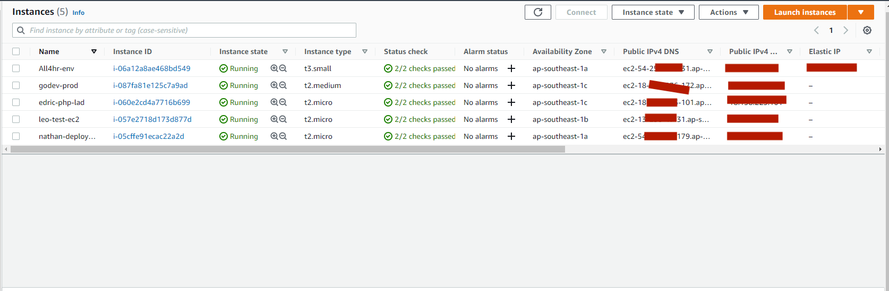
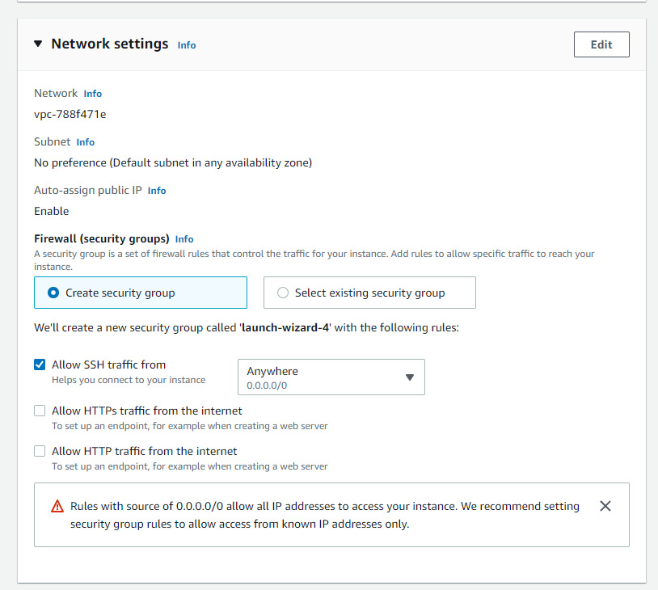

# Introducing EC2

What is Amazon EC2?
Amazon Elastic Compute Cloud (Amazon EC2) is a cloud computing infrastructure powered by Amazon Web Services (AWS) that provides virtualized computing resources on demand.
Amazon EC2 provides scalable virtualized computing applications with virtual hardware components such as computer memory (ram), processors, flexibility in the choice of storage partitions data storage in different platforms and the security of service management by AWS's powerful cloud virtualization architecture.
Amazon EC2 will provide one or more virtual servers that can be combined to easily deploy the fastest application and ensure the highest availability. Even in terms of payment, you can easily know how much you need to pay based on the information about the resources you use.

# What is Amazon EC2 Instance?
Amazon EC2 Instance is a cloud server. With one account you can create and use multiple Amazon EC2 Instances. Amazon EC2 Instances are run on the same physical server and share memory, CPU, hard drive...

However, due to the nature of the cloud service, each Instance is operated like an individual server.

# Amazon EC2 Features
1. Scaling:
Scaling Up/Down: Increase/Decrease capacity(RAM, CPU,...) of Instance.
Scaling In/Out: Increase/Decrease the number of Instances.
2. Security:
It is possible to set a private IP rank exclusively for EC2.
Use Security Group and Network ACLS to control inbound/outbound.
An IPsec VPN can be established between Data Center and AWS Cloud.
Delicated Instance -> Create EC2 on a single physical hardware for a single customer.
3. Cost:
On-Demand Instance: Calculated by the hour, meeting the needs of use in a short time. Use as much, pay as much.
Reserved Instance: Allows to prepay a server amount for 1 or 3 years. The cost is only 75% of On-Demand. If you don't need to use it for a long time, you can sell it at the Reserved Instance Marketplace

# Create and configure EC2 Instance
* Access to EC2 After creating an account and logging in to the AWS site you need to go to Services and access the EC2 dashboard page or go directly to the URL https://console.aws.amazon.com/ec2 /

* Create instance
Type in the EC2 search bar or select EC2 to enter the dashboard. This will show all the list of EC2 instances currently available.

- To create a new EC2 instance, click Launch instances

* To complement the following sample, we will create an EC2 running AWS linux 2 (used to run web services)

## 1. In order of settings including:
### 1.1 Name the EC2 instance
### 1.2 Select AMI (Amazon Machine Image), it is understood almost like the OS we want to create, it is a pre-configured version we just need to take out and use. For those of you who are new or just create aws for learning purposes and use it sparingly, you should choose the items with ``Free tier`` to get free.
Here I will choose AWS linux 2
### 1.3 Instance type
This item is to determine the hardware configuration for our server, about CPU, Ram, just choose ``Free tier``.
### 1.4 Key pair
This part will generate a private key that will allow you to SSH into our server to execute command line commands. You must have knowledge of Linux cmd
Here you will create a new key pair, then enter a name of your choice. Download the .cer or .pem key and save this file carefully. Avoid public to outsiders because if others have it, they will be able to access your server
### 1.5 Security Groups
> Security groups are a set of firewall rules that control traffic to and from your instance. Incoming rules control incoming traffic from your instance and outgoing rules control outgoing traffic from your instance. You can specify one or more security groups for your instance. If you specify multiple security groups, all rules will be evaluated to control incoming and outgoing traffic. If no value is specified, the value of the source template will still be used. If a template value is not specified then the default API value will be used.

In a nutshell, it's like a Windows firewall that allows you to open ports, allowing outsiders to access any server application.
I will keep the default to allow SSH.



### 1.6 Storage
This section specifies archiving options for the instance. allocate storage for our instances. Here AWS EC2 allows up to 30GB for free. Depending on your needs, you choose the GB you want and don't exceed 30GB to get FREE

### 2. Connect with Server EC2 Instance
So we have created a VPS server on AWS called EC2. Now I will guide you to connect to the server in 2 ways  
1. Is ssh using the computer's cmd
2. Using Centos 8 software

#### Connect use cmd
- In EC2 instance you created, click connect will show you way how connect with EC2 instance via SSH  
* Open an SSH client (cmd in windows, terminal in macOs or Zoc8).   
* Locate your private key, which you download in **1.4 Key pair** above   
* Run this command, if necessary, to ensure your key is not publicly viewable.   
    ```
    chmod 400 name_file.pem
    ```
* Connect to your instance using its Public DNS:   
**Example**:  
```
goldenowl@Edric-Mac key % ssh -i "edric-php-lad.cer" ec2-user@ec2-18-138-225-101.ap-southeast-1.compute.amazonaws.com
Last login: Mon Sep 26 02:39:05 2022 from 27.74.244.188

       __|  __|_  )
       _|  (     /   Amazon Linux 2 AMI
      ___|\___|___|

https://aws.amazon.com/amazon-linux-2/
No packages needed for security; 2 packages available
Run "sudo yum update" to apply all updates.
[ec2-user@ip-172-31-10-22 ~]$ 
````
This is template when you connected success.