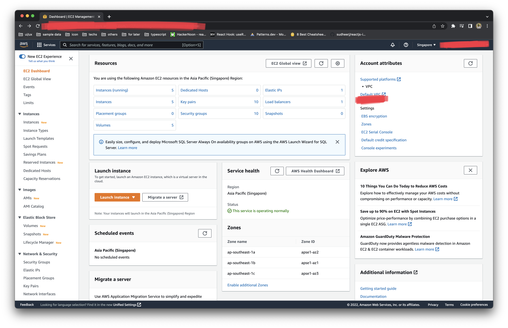
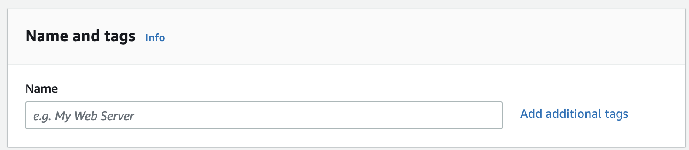
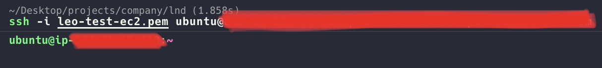

# Deploy a simple NodeJS to AWS EC2

### Table of Contents
- [Intro](#intro)
- [Deploy the server](#deploy-the-server)
  - [Create AWS EC2](#create-aws-ec2)
  - [SSH to virtual](#ssh-to-virtual)
  - [Run server in EC2](#run-server-in-ec2)
## Intro
**What is EC2?**
[EC2](https://docs.aws.amazon.com/AWSEC2/latest/UserGuide/concepts.html) (Elastic  Compute Cloud) is an environment helping your frontend, backend applications can go live in `production` or `staging`.

**What is EC2 instance?**
[EC2 instance](https://docs.aws.amazon.com/AWSEC2/latest/UserGuide/LaunchingAndUsingInstances.html) is a virtual server in the AWS Cloud. We have many ways to create an instance. In the guide, I will create it via `Launch instance` in `EC2 Dashboard`.

## Deploy the server
**Note:** You must have an AWS account and access to `EC2 Dashboard`.


#### Create AWS EC2
First, press `Launch Instance` button.

- Fill in name of instance


- Select OS of the virtual server. I often use Ubuntu here.


- Generate **key pair**. If you want to ssh to the virtual, you must have it.**
  - Press `Create new key pair`
  

  - Fill in `Key pair name`, then press `Create key pair` and **save** it in your laptop.


- Press `Launch Instance`. The instance is created successfully.


#### SSH to virtual
**Note:** If you use iTerm2 on Apple Silicon chip, I think you can met the terminal is very slow and lag. So you can try using [WARP](https://www.warp.dev/) instead.

You copy `Public IPv4 DNS` having in `Instance Information`. In current folder, you paste the `.pem` file.
```bash
$ ssh -i <file-name>.pem <publict-ipv4-dns>
```

Otherwise, you will get an error `Unprotected private key file`.
```bash
$ chmod 400 <file-name>.pem
```


#### Run server in EC2
- Set up env and others
  - Install [nvm](https://github.com/nvm-sh/nvm)
  ```bash
  $ curl -o- https://raw.githubusercontent.com/nvm-sh/nvm/v0.39.1/install.sh | bash
  $ nvm --version
  ```

  - Install node 16
  ```bash
  $ nvm install 16
  $ node -v
  ```

  - Install [yarn](https://classic.yarnpkg.com/lang/en/docs/install/#mac-stable) if the repo using yarn
  ```bash
  $ npm i -g yarn
  ```

  - Install [pm2](https://pm2.keymetrics.io/)
  ```bash
  $ npm i -g pm2
  ```

- Clone Git repository
  - Generate SSH key and create new SSH key on Github
  ```bash
  $ ssh-keygen -t rsa -b 4096
  ```

  - Clone source code
  ```bash
  $ git clone git@github.com:<repo-name>.git
  ```

  **Note:** You can try cloning the demo [here](https://github.com/GoldenOwlAsia/go-lnd/tree/deployment_js/simple-nodejs-ec2/deployment/aws/ec2/guides/js/01-simple-nodejs/sample-code).

- Run Node server
  **Note:** If you cloned my demo, you can try commands bellow. Please remember to **cd to demo folder**.
  - Install dependencies
  ```bash
  $ yarn
  ```

  - Build server
  ```bash
  $ yarn build
  ```

  - Use `pm2` to start Node one.
  ```bash
  $ pm2 start dist/server.js
  ```

  - Check log of server
  ```bash
  $ pm2 log
  ```
  

Now, the server is running on port **8080** and the url is `<public-ipv4-address>:8080`.
But I think you can get an error being `too long to respond`. You must update `inbound rules` below.


**After that, Congrats! The Node server is being run now. 🥳🥳🥳**

**Please do not share any AWS information on the Internet. ⚠️⚠️⚠️**
