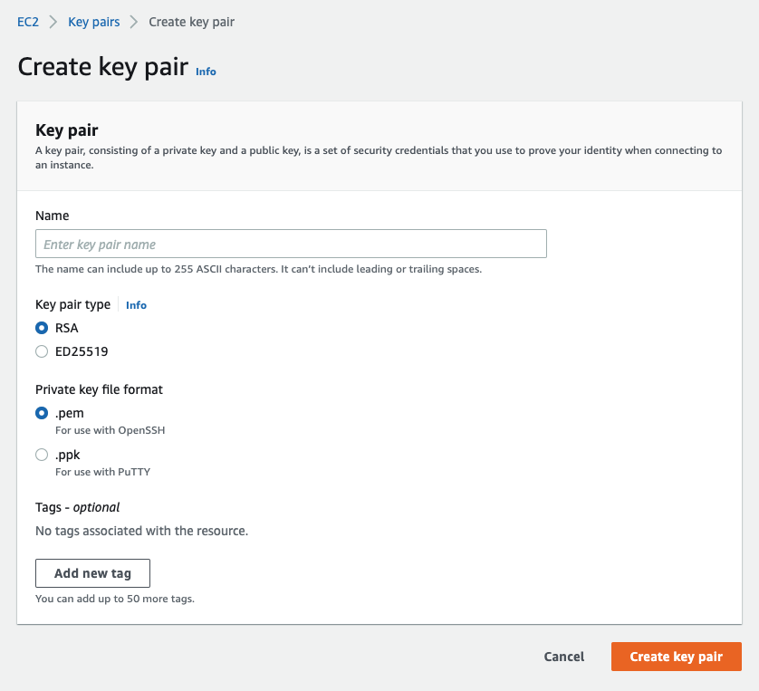
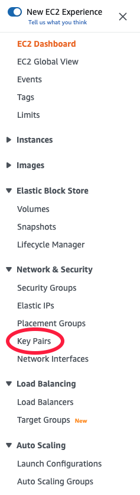

# Understanding A Key Pair

### Table of Contents
- [Intro](#intro)
- [Create a key pairs](#create-a-key-pairs)
- [Lost key pairs][#lost-key-pairs]

## Intro
- A key pair is **a combination of a public key that is used to encrypt data and a private key that is used to decrypt data**. When we create an instance, we must create a key pair helping us to connect to the virtual in ssh.



**Note:** Please do not forget that **anyone has our private key can connect to our instances**, so we store it carefully.

## Create a key pairs
- Open the EC2 dashboard. Look at the navigation pane, in **Network & Security**, press **Key Pairs**.



- Press **Create key pair**


- Fill in key pair information and press `Create key pair`


The private key file is automatically downloaded by our browser. Save it in a secure place.

- If you want to SSH to the virtual, we will must run below

```bash
  chmod 400 <key-pair-name>.pem
```

Now we can SSH to the virtual with the private key file.

## Lost key pairs