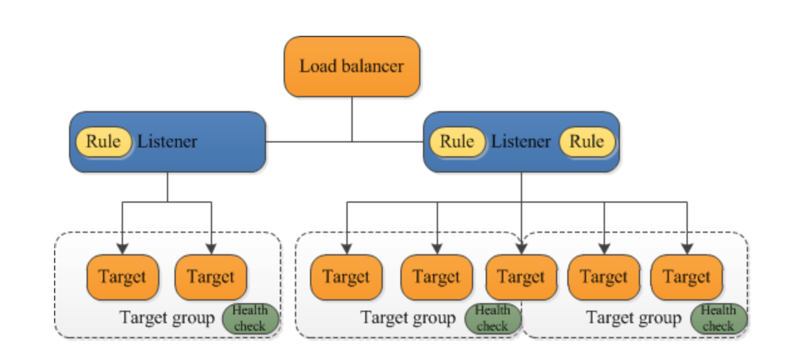
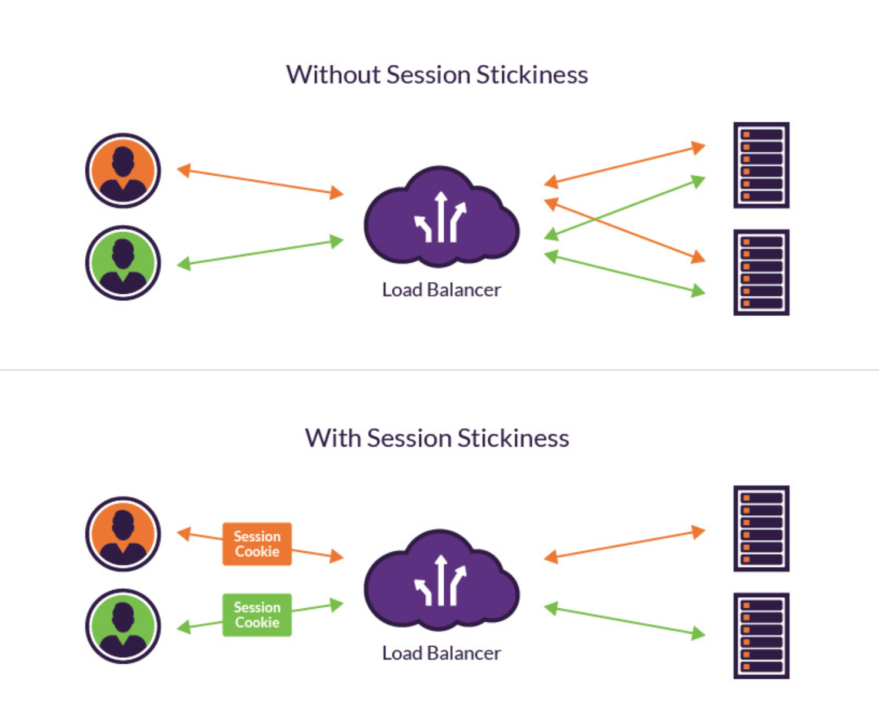
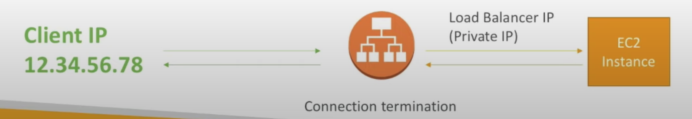
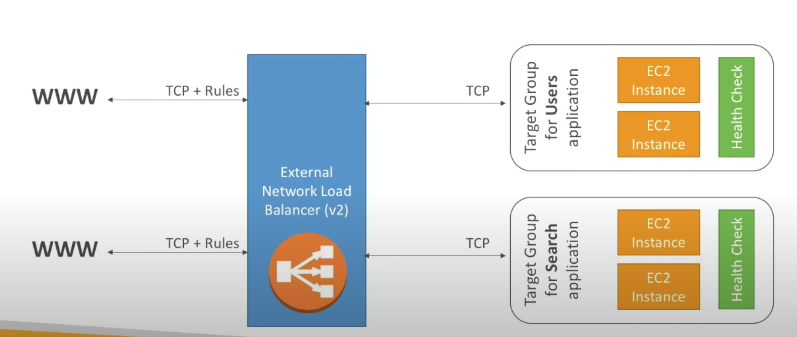
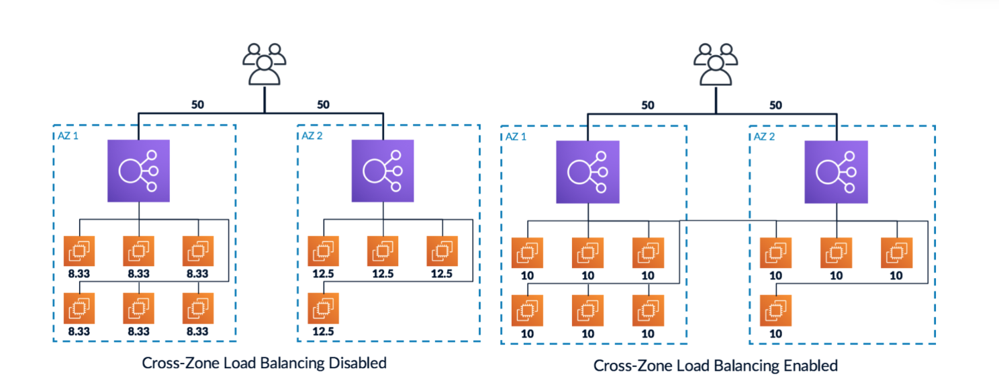

# Load Balancer Common
## What is Load Balancing
Load balancing refers to efficiently distributing incoming network traffic across a group of backend servers, also known as a server farm or server pool.   
Modern high‑traffic websites must serve hundreds of thousands, if not millions, of concurrent requests from users or clients and return the correct text, images, video, or application data, all in a fast and reliable manner. To cost‑effectively scale to meet these high volumes, modern computing best practice generally requires adding more servers.
## What is Load Balancer
A load balancer acts as the “traffic cop” sitting in front of your servers and routing client requests across all servers capable of fulfilling those requests in a manner that maximizes speed and capacity utilization and ensures that no one server is overworked, which could degrade performance. If a single server goes down, the load balancer redirects traffic to the remaining online servers. When a new server is added to the server group, the load balancer automatically starts to send requests to it.

In this manner, a load balancer performs the following functions:

- Distributes client requests or network load efficiently across multiple servers
- Ensures high availability and reliability by sending requests only to servers that are online
- Provides the flexibility to add or subtract servers as demand dictates

I will talk routes of request to server have Load Balaner. 
1. EndUser(1) send request, instead of redirect to Server, it send to Load Balancer.
2. Load Balancer will direct send request to Server Application
3. Server Application will reponse for Load Balancer
4. Load Balancer send reponse for EndUser

## Load Balancing Algorithms
Different load balancing algorithms provide different benefits; the choice of load balancing method depends on your needs:

- **Round Robin** – Requests are distributed across the group of servers sequentially.
- **Least Connections** – A new request is sent to the server with the fewest current connections to clients. The relative computing capacity of each server is factored into determining which one has the least connections.
- **Least Time** – Sends requests to the server selected by a formula that combines the
fastest response time and fewest active connections. Exclusive to NGINX Plus.
- **Hash** – Distributes requests based on a key you define, such as the client IP address or
the request URL. NGINX Plus can optionally apply a consistent hash to minimize redistribution
of loads if the set of upstream servers changes.
- **IP Hash** – The IP address of the client is used to determine which server receives the request.
- **Random with Two Choices** – Picks two servers at random and sends the request to the
one that is selected by then applying the Least Connections algorithm (or for NGINX Plus
the Least Time algorithm, if so configured).

## Benefits of Load Balancing
* Reduced downtime
* Scalable
* Redundancy
* Flexibility
* Efficiency

# AWS Elastic Load Balancer
Elastic Load Balancer (ELB) provide by Amazon. It automatically distributes your incoming traffic across multiple targets, such as EC2 instances, containers, and IP addresses, in one or more Availability Zones. It monitors the health of its registered targets, and routes traffic only to the healthy targets. Elastic Load Balancing scales your load balancer as your incoming traffic changes over time. It can automatically scale to the vast majority of workloads.   

## Why use a Load Balancer & Elastic Load Balancer of AWS?
- Support and guaranteed by AWS (Upgrades, Maintenance, High Availability, Configuration knobs...).
- Low installation cost but many good results in the long run.
- Integrated with many AWS services.
- Spread load across multiple downstream instances.
- Expose a single point of access (DNS) to your application.
- Seamlessly handle failures of downstream instances.
- Do regular healthy checks to your instances.
- Provide SSL termination (HTTPS) for your website.
- Enforce stickiness with cookies.
- High availability across zones.
- Separate public traffic from private trafiic.

## Health Check
Health Checks are crucial for Load Balancer.  
They anable the load balancer to know if instances it forwards traffic to are available to reply to requests. The health check is done on a port and a route (/heath is common). If the response is not 200 (OK), the the instance is unhealthy.

## Type of Load Balancer on AWS
#### AWS has 4 kinds of Load Balancers
- Classic Load Balancer (v1 - old generation) - 2009 - **CLB**
- Application Load Balancer (v2 - new generation) - 2016 - **ALB**
- Network Load Balancer (v2 - new generation) - 2017 - **NLB**
- Gateway Load Balancer - 2020 - **GLB**   

In present, AWS has support 3 kinds new version, they removed **CLB**, it's recommended to use the newer(v2) generation load balancers as thay provide more features. And you can setup *internal* (private) or *external* (public) ELBs.

## Application Load Balancer (v2)
#### Application load balancers (layer 7, application layer) allow to do:
- Load balancing to multiple HTTP applications across machines (target groups)
- Load balancing to multiple applications on the same machine (ex: containers)
- Load balancing based on route in URL
- Load balancing base on hostname in URL
#### Basically, they're awesome for micro services & container-based application (example: Docker & Amazon ECS).
#### Has a port mapping feature to redirect to a dynamic port.
#### In comparisaion, we would need to create one Classic Load Balancer per application before. That was very expensive and inefficient!

### Target Group
A target group tells a load balancer where to direct traffic to : EC2 instances, fixed IP addresses; or AWS Lambda functions, amongst others. When creating a load balancer, you create one or more listeners and configure listener rules to direct the traffic to one target group.   
Each target group is used to route requests to one or more registered targets. When you create each listener rule, you specify a target group and conditions. When a rule condition is met, traffic is forwarded to the corresponding target group. You can create different target groups for different types of requests. For example, create one target group for general requests and other target groups for requests to the microservices for your application. For more information, see [Application Load Balancer components.](https://docs.aws.amazon.com/elasticloadbalancing/latest/application/introduction.html#application-load-balancer-components)

### Sticky Session
By default, an Application Load Balancer routes each request independently to a registered target based on the chosen load-balancing algorithm. However, you can use the sticky session feature (also known as session affinity) to enable the load balancer to bind a user's session to a specific target. This ensures that all requests from the user during the session are sent to the same target. This feature is useful for servers that maintain state information in order to provide a continuous experience to clients. To use sticky sessions, the client must support cookies.

When a user sends a request for the first time to the Load Banlancer, which specifies a server to handle that request, the next time the request is made, it will still be the same server that handles the request. This feature is mainly used to ensure that an in-proc session will not be lost by requests for the session being routed to different servers.

### *GOOD TO KNOW*
- Stickiness can be anabled at the target group level.
    * Same request goes to the same instance.
    * Stickiness is directly generated by the ALB (not the application).
- ALB support HTTP/HTTPS & Websockets protocols.
- The application servers don't see the IP of the client directly
    * The true IP of the client is inserted in the header **X-Forwarded-For**
    * We can also get Port (X-Forward-Port) and proto (X-Forwarded-Proto)

    
## Network Load Balancer (v2)
#### Network Load Balancer (Layer 4) allow to do:
- Forward TCP traffic to your instances.
- Handle milions of request per seconds.
- Support for static IP or elastic IP.
- Less latency ~ 100ms (vs 400ms of ALB).   
Network Load Balancers are mostly used for extreme performance and should not be the default load balancer you choose (not support tier free). So, if you want to load balancing for Database, Mysql, MongoDb or elasticSearch... so NLB is the best choose.   
Overall, the creation process is the same as Application Load Balancers.

## Gateway Load Balancer (v2)
#### Gateway Load Balancer (Layer 3, network layer) allow to do:
- Deploy and manage a fleet of third-party virtual appliances that support GENEVE protocol on port 6081.
- These appliances enable you to improve security, compliance, and policy controls.

## Across-Zone in Load Balancing
Cross-zone load balancing reduces the need to maintain equivalent numbers of instances in each enabled Availability Zone, and improves your application's ability to handle the loss of one or more instances.
