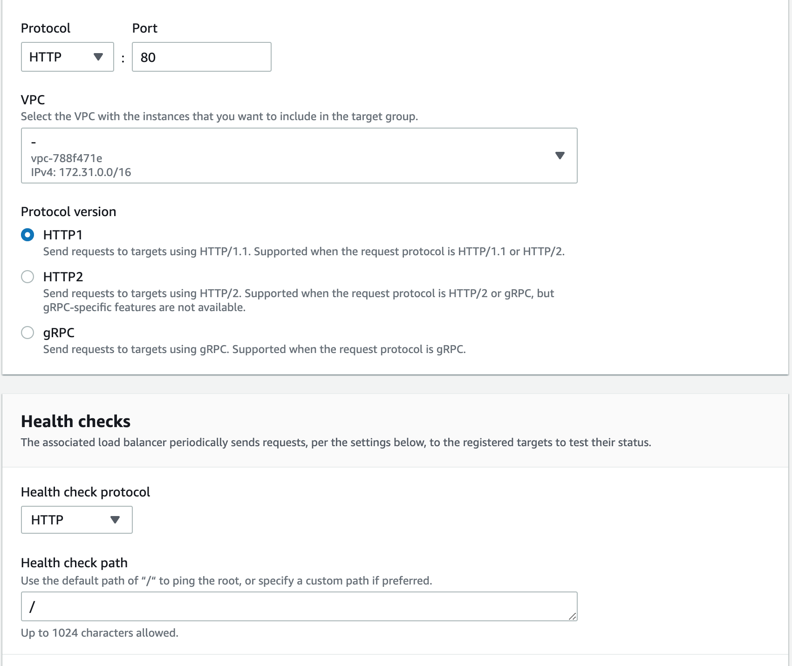
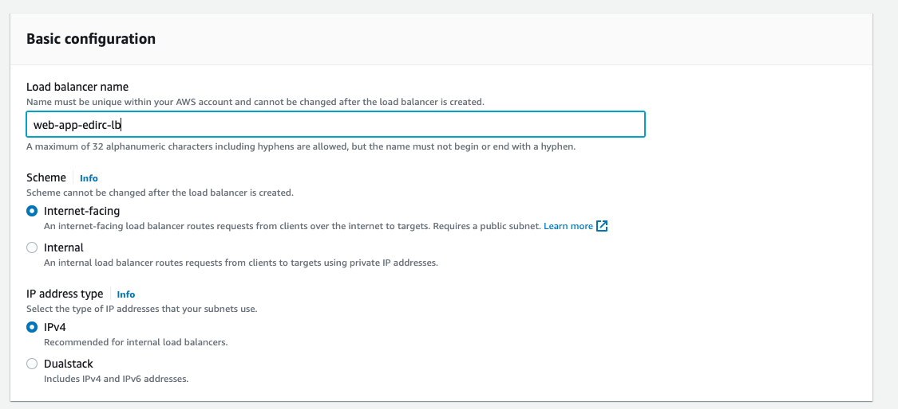
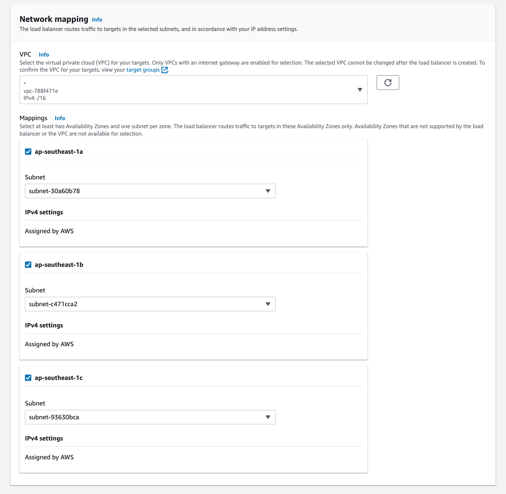
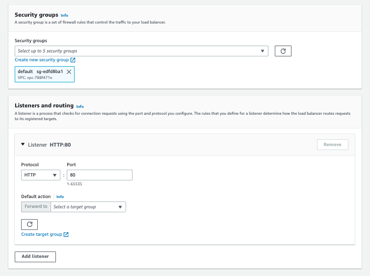

# **Create an Application Load Balancer**

A load balancer takes requests from clients and distributes them across targets in a target group.

Before you begin, ensure that you have a virtual private cloud (VPC) with at least one public subnet in each of the Availability Zones used by your targets.

To create a load balancer using the AWS CLI, see Tutorial: [Create an Application Load Balancer using the AWS CLI.](https://docs.aws.amazon.com/elasticloadbalancing/latest/application/tutorial-application-load-balancer-cli.html)

To create a load balancer using the AWS Management Console, complete the following tasks.
Prepair: 
- At least 2 EC2 instances are required to deploy the Web source code, possibly different for ease of comparison.
In instance i have 2 EC2 instance, 1 is LAMP deploy Laravel Project (**A website**) and 1 is Nginx just contain 1 file html sample (**B website**).

## **Step 1: Configure a target group**
Configuring a target group allows you to register targets such as EC2 instances. The target group that you configure in this step is used as the target group in the listener rule when you configure your load balancer.    
**Note:** : Target group contain list EC2 instances which i said prepair above.  

  
### **To configure your target group**
1. Open the Amazon EC2 console at [https://console.aws.amazon.com/ec2/](https://console.aws.amazon.com/ec2/)

2. In the left navigation pane, under **Load Balancing**, choose **Target Groups**.

3. Choose **Create target group.**

4. In the **Basic configuration** section, set the following parameters:
    - For **Choose a target type**, select **Instance** to specify targets by instance ID or **IP addresses** to specify targets by IP address. If the target type is a **Lambda function**, you can enable health checks by selecting **Enable** in the **Health checks** section. 
    In this sample, i choose **Instances**
    - For **Target group name**, enter a name for the target group. (Example: web-app-target-group)

    - Modify the **Port** and **Protocol** as needed.

    - If the target type is I**P addresses**, choose **IPv4** or *IPv6* as the **IP address** type, otherwise skip to the next step.  
    Note that only targets that have the selected IP address type can be included in this target group. The IP address type cannot be changed after the target group is created.

    - For VPC, select a virtual private cloud (VPC) with the targets that you want to include in your target group.

    - For **Protocol version**, select **HTTP1** when the request protocol is HTTP/1.1 or HTTP/2; select **HTTP2**, when the request protocol is HTTP/2 or gRPC; and select **gRPC**, when the request protocol is gRPC.

    

5. In the **Health checks** section, modify the default settings as needed. For **Advanced health check settings**, choose the health check port, count, timeout, interval, and specify success codes. If health checks consecutively exceed the **Unhealthy threshold** count, the load balancer takes the target out of service. If health checks consecutively exceed the **Healthy threshold** count, the load balancer puts the target back in service.   
In this sample, i set default.

    

6. (Optional) Add one or more tags as follows:
    - Expand the **Tags** section.

    - Choose Add tag.

    - Enter the tag Key and tag Value. Allowed characters are letters, spaces, numbers (in UTF-8), and the following special characters: + - = . _ : / @. Do not use leading or trailing spaces. Tag values are case-sensitive.

7. Choose **Next**.

## **Step 2: Register targets**

You can register EC2 instances, IP addresses, or Lambda functions as targets in a target group. This is an optional step to create a load balancer. However, you must register your targets to ensure that your load balancer routes traffic to them.

1. In the **Register targets** page, add one or more targets as follows:

    - If the target type is **Instances**, select one or more instances, enter one or more ports, and then choose **Include as pending below**.

    - If the target type is **IP addresses**, do the following:

        * Select a network VPC from the list, or choose **Other private IP addresses**.

        * Enter the IP address manually, or find the IP address using instance details. You can enter up to five IP addresses at a time.

        * Enter the ports for routing traffic to the specified IP addresses.

        * Choose **Include as pending below**.

    - If the target type is **Lambda**, select a Lambda function, or enter a Lambda function ARN, and then choose **Include as pending below**.

    

2. Choose **Create target group**.

## **Step 3: Configure a load balancer and a listener**

To create an Application Load Balancer, you must first provide basic configuration information for your load balancer, such as a name, scheme, and IP address type. Then, you provide information about your network, and one or more listeners. A listener is a process that checks for connection requests. It is configured with a protocol and a port for connections from clients to the load balancer.

### **To configure your load balancer and listener**

1. Open the Amazon EC2 console at https://console.aws.amazon.com/ec2/.

2. In the navigation pane, under **Load Balancing**, choose **Load Balancers**.

3. Choose **Create Load Balancer**.

4. Under **Application Load Balance**r, choose **Create**.

5. **Basic configuration**
    - For **Load balancer name**, enter a name for your load balancer. For example, *my-alb*. The name of your Application Load Balancer must be unique within your set of Application Load Balancers and Network Load Balancers for the Region. Names can have a maximum of 32 characters, and can contain only alphanumeric characters and hyphens. They can not begin or end with a hyphen, or with *internal-*.

    - For **Scheme**, choose **Internet-facing** or **Internal**. An internet-facing load balancer routes requests from clients to targets over the internet. An internal load balancer routes requests to targets using private IP addresses.

    - For **IP address type**, choose **IPv4** or **Dualstack**. Use **IPv4** if your clients use IPv4 addresses to communicate with the load balancer. Choose **Dualstack** if your clients use both IPv4 and IPv6 addresses to communicate with the load balancer.
   
    
6. **Network mapping**

    - For **VPC**, select the VPC that you used for your EC2 instances. If you selected **Internet-facing** for **Scheme**, only VPCs with an internet gateway are available for selection.

    - For **Mappings**, select two or more Availability Zones and corresponding subnets. Enabling multiple Availability Zones increases the fault tolerance of your applications.   
    For an internal load balancer, you can assign a private IP address from the IPv4 or IPv6 range of each subnet instead of letting AWS assign one for you.   
    Select one subnet per zone to enable. If you enabled **Dualstack** mode for the load balancer, select subnets with associated IPv6 CIDR blocks. You can specify one of the following:   
        * Subnets from two or more Availability Zones
        * Subnets from one or more Local Zones
        * One Outpost subnet

    
7. For **Security groups**, select an existing security group, or create a new one.
    The security group for your load balancer must allow it to communicate with registered targets on both the listener port and the health check port. The console can create a security group for your load balancer on your behalf with rules that allow this communication. You can also create a security group and select it instead.   
    (Optional) To create a new security group for your load balancer, choose **Create a new security group**.

8. For **Listeners and routing**, the default listener accepts HTTP traffic on port 80. You can keep the default protocol and port, or choose different ones. For Default action, choose the target group that you created (**step 1**). You can optionally choose Add listener to add another listener (for example, an HTTPS listener).   

    If you create an HTTPS listener, configure the required Secure listener settings. Otherwise, go to the next step.   
    
    When you use HTTPS for your load balancer listener, you must deploy an SSL certificate on your load balancer. The load balancer uses this certificate to terminate the connection and decrypt requests from clients before sending them to the targets. Additionally, specify the security policy that the load balancer uses to negotiate SSL connections with the clients.

    For **Default SSL certificate**, do one of the following:   

    - If you created or imported a certificate using AWS Certificate Manager, select **From ACM**, and then select the certificate.
    - If you uploaded a certificate using IAM, select **From IAM**, and then select the certificate.
    - If you want to import a certificate to ACM or IAM , enter a certificate name. Then, paste the PEM-encoded private key and body.

    
9. (Optional) You can use **Add-on services**, such as the **AWS Global Accelerator** to create an accelerator and associate the load balancer with the accelerator. The accelerator name can have up to 64 characters. Allowed characters are a-z, A-Z, 0-9, . and - (hyphen). Once the accelerator is created, you can use the **AWS Global Accelerator** console to manage it.

10. **Tag and create**
    - (Optional) Add a tag to categorize your load balancer. Tag keys must be unique for each load balancer. Allowed characters are letters, spaces, numbers (in UTF-8), and the following special characters: + - = . _ : / @. Do not use leading or trailing spaces. Tag values are case-sensitive.

    - Review your configuration, and choose **Create load balancer**. A few default attributes are applied to your load balancer during creation. You can view and edit them after creating the load balancer.

## **Step 4: Test the load balancer**
- In the navigation pane, under Load Balancing, choose Load Balancers.

- Select the newly created load balancer.

- Choose Description and copy the DNS name of the load balancer (for example, my-load-balancer-1234567890abcdef.elb.us-east-2.amazonaws.com). Paste the DNS name into the address field of an internet-connected web browser. If everything is working, the browser displays the default page of your server.
- We have 2 instances and deploy not same source code. When you refresh (F5) in brower, The website will be displayed in turn from **A website** to **B website**

# Bonus
You can still access 2 pages through ipv4 or DNS names of versions, how can I only access through DNS of ALB. Here is the answer :)))
- You remember security group name that created (part 7 of step 3).
- In **Network & Security**, choose **Security Group**
- Choose **Security Group** of **Instance** you created 
- Tag **Inbound rules**, click **Edit inbound rules**
- Delete rules **HTTP** port **80**, and add new rule
- Select **HTTP** & port **80**, but **Source** part, type name of security Group of ALB.
- Save and enjoy