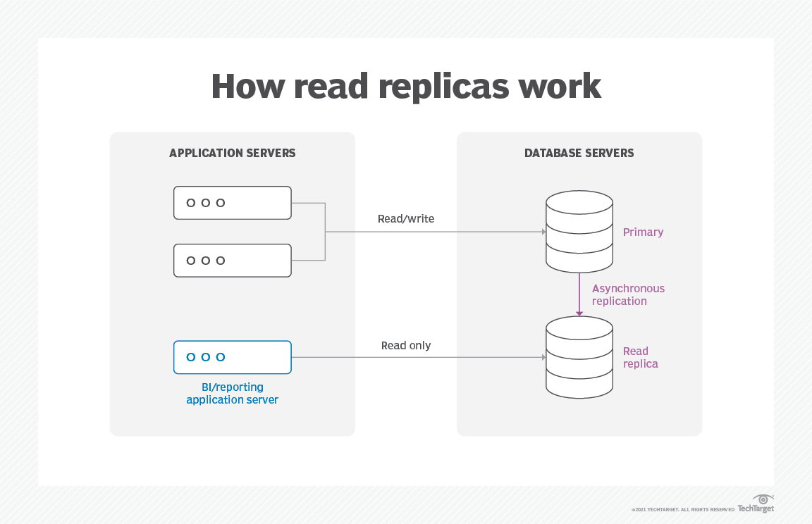
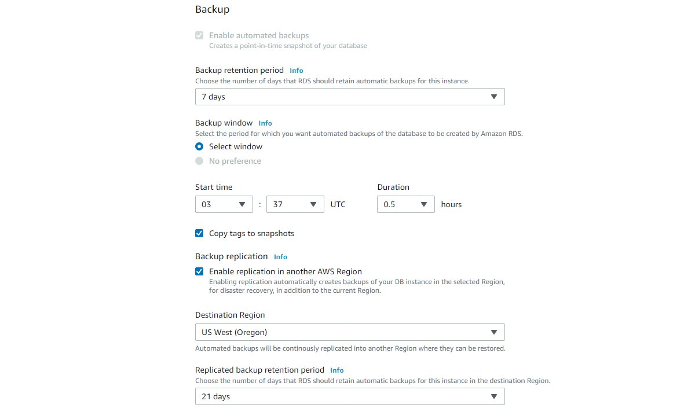

# Getting Started with Amazon RDS

### Table of Contents
1. What is Amazon RDS?
2. How does Amazon RDS work?
3. Amazon RDS features
4. Amazon RDS database engines

## What is Amazon RDS?
Amazon Relational Database Service (RDS) is a managed SQL database service provided by Amazon Web Services (AWS). Amazon RDS supports an array of database engines to store and organize data. It also helps with relational database management tasks, such as data migration, backup, recovery and patching.

Amazon RDS facilitates the deployment and maintenance of relational databases in the cloud. A cloud administrator uses Amazon RDS to set up, operate, manage and scale a relational instance of a cloud database. Amazon RDS is not itself a database; it is a service used to manage relational databases.

## How does Amazon RDS work?
Databases are used to store large quantities of data that applications can draw on to help them perform various functions. A relational database uses tables to store data. It is called relational because it organizes data points with defined relationships.

Administrators control Amazon RDS with the AWS Management Console, Amazon RDS API calls or the AWS Command Line Interface. They use these interfaces to deploy database instances to which users can apply specific settings.

Amazon provides several instance types with different combinations of resources, such as CPU, memory, storage options and networking capacity. Each type comes in a variety of sizes to suit the needs of different workloads.

RDS users can use AWS Identity and Access Management to define and set permissions for who can access an RDS database.

## Amazon RDS features
Amazon RDS features include the following:

### Replication
RDS uses the Replication feature to create read replicas. These are read-only copies of database instances that applications use without altering the original production database. Administrators can also enable automatic failover across multiple availability zones through RDS Multi-AZ deployment and with synchronous data replication.

### Storage
RDS provides three types of storage:

- **General-purpose solid-state drive (SSD)**: Amazon recommends this storage as the default choice.
- **Provisioned input-output operations per second (IOPS)**: SSD storage for I/O-intensive workloads.
- **Magnetic**: A lower cost option.
- **Monitoring**: The Amazon CloudWatch service enables managed monitoring. It lets users view capacity and I/O metrics.

### Patching
RDS provides patches for whichever database engine the user chooses.

### Backups
Another feature is failure detection and recovery. RDS provides managed instance backups with transaction logs to enable point-in-time recovery. Users pick a retention period and restore databases to any time during that period. They also can manually take snapshots of instances that remain until they are manually deleted.

### Incremental billing
Users pay a monthly fee for the instances they launch.

### Encryption
RDS uses public key encryption to secure automated backups, read replicas, data snapshots and other data stored at rest.

## Amazon RDS database engines
An AWS customer can spin up six types of database engines within Amazon RDS:

- **Amazon Aurora** is a proprietary AWS relational database engine. Amazon Aurora is compatible with MySQL and PostgreSQL.
- **RDS for MariaDB** is compatible with MariaDB, an open source relational database management system (RDBMS) that's an offshoot of MySQL.
- **RDS for MySQL** is compatible with the MySQL open source RDBMS.
- **RDS for Oracle Database** is compatible with several editions of Oracle Database, including bring-your-own-license and license-included versions.
- **RDS for PostgreSQL** is compatible with PostgreSQL open source object-RDBMS.
- **RDS for SQL Server** is compatible with Microsoft SQL Server, an RDBMS.

AWS provides other database services, including the following:
- **Amazon DynamoDB** key-value and document database for NoSQL databases;
- **Amazon Neptune** for graph databases; and
- **AWS Database Migration Service** to ease database transfers and transformations.
