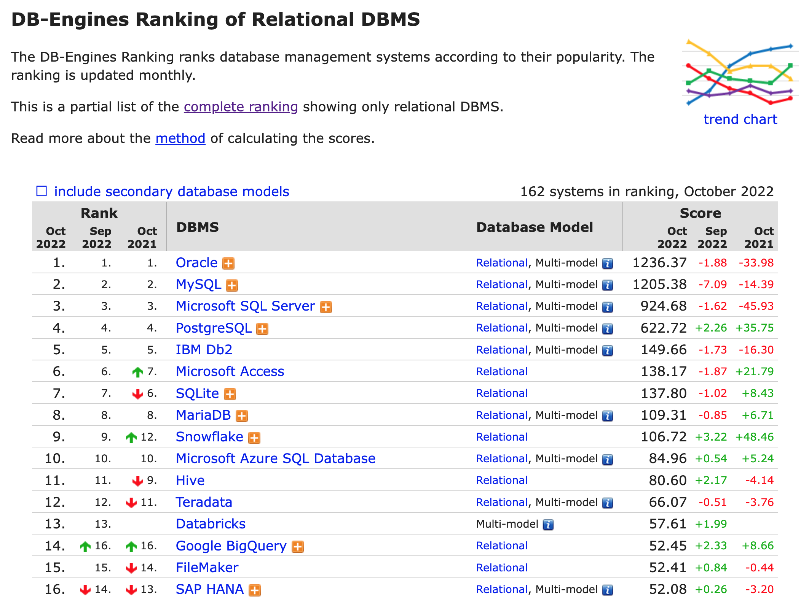

# Introduction about SQL and NoSQL
When choosing a modern database, one of the biggest decisions is picking a **relational** (SQL) or **non-relational** (NoSQL) data structure. While both are viable options, there are key differences between the two that users must keep in mind when making a decision.

Here, we break down the most important distinctions and discuss the best SQL and NoSQL database systems available.

The five critical differences between SQL vs NoSQL are:
- SQL databases are relational, NoSQL databases are non-relational.
- SQL databases use structured query language and have a predefined schema. NoSQL databases have dynamic schemas for unstructured data.
- SQL databases are vertically scalable, while NoSQL databases are horizontally scalable.
- SQL databases are table-based, while NoSQL databases are document, key-value, graph, or wide-column stores.
- SQL databases are better for multi-row transactions, while NoSQL is better for unstructured data like documents or JSON.

Specifically, there are some differences that need to be focused on:
1. Scalability
2. Structure
3. Properties

### 1. Scalability
Most SQL databases can be scaled vertically, by increasing the processing power of existing hardware. NoSQL databases use a master-slave architecture which scales better horizontally, with additional servers or nodes. These are useful generalizations, but it’s important to note:

- SQL databases can be scaled horizontally as well, though sharding or partitioning logic is often the user’s onus and not well supported.
- NoSQL technologies are diverse and while many rely on the master-slave architecture, options for scaling vertically also exist.
- Savings made using more efficient data structures can overwhelm differences in scalability; most important is to understand the use case and plan accordingly.

### 2. Structure
SQL database schemata always represent relational, tabular data, with rules about consistency and integrity. They contain tables with columns (attributes) and rows (records), and keys have constrained logical relationships.

NoSQL databases need not stick to this format, but generally fit into one of four broad categories:
- **Column-oriented** databases transpose row-oriented RDBMSs, allowing efficient storage of high-dimensional data and individual records with varying attributes.
- **Key-Value** stores are dictionaries which access diverse objects with a key unique to each.
- **Document** stores hold semi-structured data: objects which contain all of their own relevant information, and which can be completely different from each other.
- **Graph databases** add the concept of relationships (direct links between objects) to documents, allowing rapid traversal of greatly connected data sets.

### 3. Properties
At a high level, SQL and NoSQL comply with separate rules for resolving transactions. RDBMSs must exhibit four “ACID” properties:
- **Atomicity** means all transactions must succeed or fail completely. They cannot be partially-complete, even in the case of system failure.
- **Consistency** means that at each step the database follows invariants: rules which validate and prevent corruption.
- **Isolation** prevents concurrent transactions from affecting each other. Transactions must result in the same final state as if they were run sequentially, even if they were run in parallel.
- **Durability** makes transactions final. Even system failure cannot roll-back the effects of a successful transaction.

NoSQL technologies adhere to the “CAP” theorem, which says that in any distributed database, only two of the following properties can be guaranteed at once:
- **Consistency**: Every request receives the most recent result, or an error. (Note this is different than in ACID)
- **Availability**: Every request has a non-error result, regardless of how recent that result is.
- **Partition tolerance**: Any delays or losses between nodes will not interrupt the system’s operation.

# SQL and NoSQL databases
Some featured SQL databases:
- **MS-SQL** is Microsoft’s relational database product, accessed with the proprietary Transact-SQL (T-SQL), and offered in a dozen editions targeted to different end users. Microsoft Azure includes a dedicated component for scaling MS-SQL databases in the cloud.
- **Oracle Database** is among the oldest and most-established RDBMSs. Its relational store is interfaced by PL/SQL, though it is adapting into a multi-model system.

Other major RDBMSs include **Access**, **Ingres**, **PostgreSQL**, **Sybase**, and **SQLite**.

Some featured NoSQL databases:
- **Apache CouchDB**, like **MongoDB**, is a document-oriented database with JSON schemata and querying over JavaScript. CouchDB’s scaling capabilities stand out, employing a multi-master architecture over the typical single-master distributed design.
- **Redis** (Remote Dictionary Server), is the most popular key-value database. It is open-source, with a fast and distributed in-memory implementation, and supports many abstract data structures (some rarely found in other NoSQL).
- **InfinityDB** and **Amazon’s DynamoDB** implement two other key-value stores. Columnar stores like **Cassandra**, **MariaDB**, and **Scylla** scale well horizontally, and popular graph databases include **ArangoDB**, **InfiniteGraph**, and **Neo4j**.

# When to use SQL or NoSQL for your business.
Generally, NoSQL is preferred for:
- Graph or hierarchical data
- Data sets which are both large and mutate significantly,
- Businesses growing extremely fast but lacking data schema.

In terms of use cases, this might translate to social networks, online content management, streaming analytics, or mobile applications.

SQL is more appropriate when the data is:
- Small
- Conceptually modeled as tabular
- In systems where consistency is critical.

Think small business’ accounting systems, sales databases, or transactional systems like payment processing in e-commerce. When in doubt, SQL is also more appropriate, as RDBMSs are better supported and fault-tolerant.
