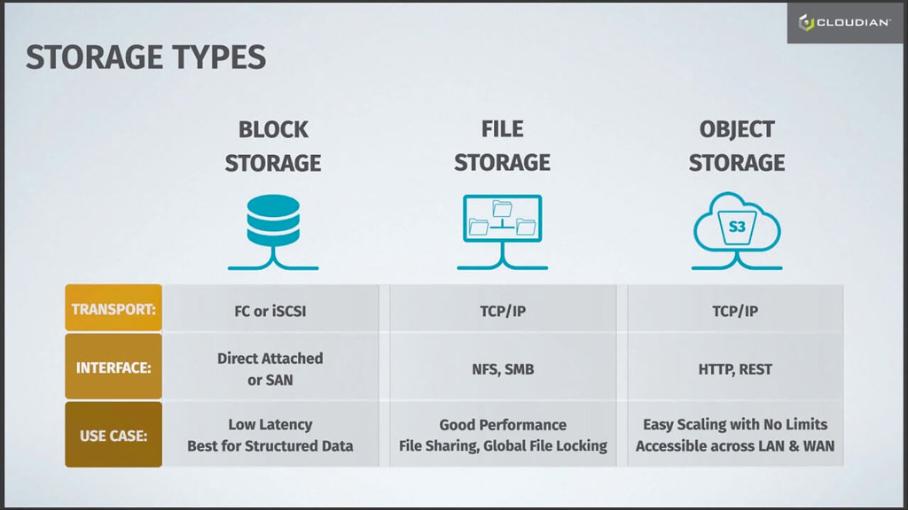
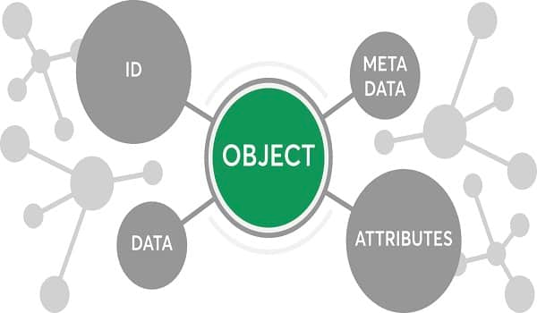

# Amazon Simple Storage Service (AWS S3)

## Basic Object Storage
### What is Object Storage?
Object Storage, also called _Object-base storage_ is relatively new when compared with more traditional storage systems such as **file** or **block storage**. So, what is object storage, exactly? In short, it is storage for unstructured data that eliminates the scaling limitations of traditional file storage. Limitless scale is the reason that object storage is the storage of the cloud.
All of the major public cloud services, including Amazon, Google and Microsoft, employ object storage as their primary storage.   
Object storage delivers limitless scale because — unlike the addressing hierarchy used with traditional file storage — object-based storage employs a flat file system that has no built-in limits.
Hence, it’s able to hold huge volumes of unstructured data such as audio, video, emails, health records, and documents. For a visual representation of object storage.   
Object-based storage uses TCP/IP as its transport, and devices communicate using HTTP and REST APIs.

### Compare with another Storage

#### File storage
File storage stores data in folders. This method, also known as hierarchical storage, simulates how paper documents are stored.
When data needs to be accessed, a computer system must look for it using its path in the folder structure.

File storage uses TCP/IP as its transport, and devices typically use the NFS protocol in Linux and SMB in Windows.

#### Block storage
Block storage splits a file into separate data blocks, and stores each of these blocks as a separate data unit. Each block has an address, and so the storage system can find data without needing a path to a folder.
This also allows data to be split into smaller pieces and stored in a distributed manner. Whenever a file is accessed, the storage system software assembles the file from the required blocks.

Block storage uses FC or iSCSI for transport, and devices operate as direct attached storage or via a storage area network (SAN).

### Object Storage Architecture

The object storage has 4 properties: ID, META DATA, DATA, ATTRIBUTES

### Some reason to Use Object Storage
**1. Custom Metadata & Searchability**  
When it comes to object storage, metadata resides in the objects themselves. There is no need to build databases to associate metadata with the objects. Custom metadata can be created about an object file based on contents, dates, user information, permissions, etc. Attributes can be changed and added over time. Because of custom metadata, object storage is highly searchable. Users can conduct searches that return a set of files that meet specific criteria, such as what percentage of files are of a certain type or created by certain owner. This allows companies to extract insights from the big data they possess within their files and identify trends.

**2. Resiliency**   
When an object is created, it is copied to one or more nodes depending on the policies in place. Nodes are normally spread out geographically, allowing for automatic, cost-effective disaster recovery for object files.

**3. Archive Management**  
Because of its custom metadata and resiliency, object storage systems are ideal for digitizing and storing old documents and audio and video content.

**4. Automated Information Life Cycle Management**  
Object files can manage, repair, retire, delete and deduplicate themselves based on information provided in metadata, making information life cycle management extremely efficient.

**5. Unlimited Scalability**   
As object storage grows, it can be scaled out horizontally by adding nodes. Metadata stays with objects, allowing for a flat system, often referred to as storage pools. In flat data environments, scalability is virtually unlimited. Unlike traditional storage, object storage does not become inefficient and difficult to manage with large volumes of data.

**6. Cost-effective**  
Part of what makes object storage cost-effective is that less hardware is needed for large volumes of data. Also, object storage is often acquired as an OpEx solution, using a pay-as-you-go model in the cloud.

**7. Convenient**  
Object storage fits the needs of an increasingly mobile workforce. Because of the HTTP interface, object files have a unique URL can be accessed from anywhere in the world and from any device.

## Amazon S3
Amazon Simple Storage Service (Amazon S3) is an object storage service that offers industry-leading scalability, data availability, security, and performance.

Customers of all sizes and industries can use Amazon S3 to store and protect any amount of data for a range of use cases, such as data lakes, websites, mobile applications, backup and restore, archive, enterprise applications, IoT devices, and big data analytics.
Amazon S3 provides management features so that you can optimize, organize, and configure access to your data to meet your specific business, organizational, and compliance requirements.

## Features of Amazon S3
### Storage classes
Amazon S3 offers a range of storage classes designed for different use cases. For example, you can store mission-critical production data in S3 Standard for frequent access, save costs by storing infrequently accessed data in S3 Standard-IA or S3 One Zone-IA, and archive data at the lowest costs in S3 Glacier Instant Retrieval, S3 Glacier Flexible Retrieval, and S3 Glacier Deep Archive.

You can store data with changing or unknown access patterns in S3 Intelligent-Tiering, which optimizes storage costs by automatically moving your data between four access tiers when your access patterns change. These four access tiers include two low-latency access tiers optimized for frequent and infrequent access, and two opt-in archive access tiers designed for asynchronous access for rarely accessed data.

Amazon S3 has storage management features that you can use to manage costs, meet regulatory requirements, reduce latency, and save multiple distinct copies of your data for compliance requirements.

- **S3 Lifecycle** – Configure a lifecycle policy to manage your objects and store them cost effectively throughout their lifecycle. You can transition objects to other S3 storage classes or expire objects that reach the end of their lifetimes.

- **S3 Object Lock** – Prevent Amazon S3 objects from being deleted or overwritten for a fixed amount of time or indefinitely. You can use Object Lock to help meet regulatory requirements that require write-once-read-many (WORM) storage or to simply add another layer of protection against object changes and deletions.

- **S3 Replication** – Replicate objects and their respective metadata and object tags to one or more destination buckets in the same or different AWS Regions for reduced latency, compliance, security, and other use cases.

- **S3 Batch Operations** – Manage billions of objects at scale with a single S3 API request or a few clicks in the Amazon S3 console. You can use Batch Operations to perform operations such as Copy, Invoke AWS Lambda function, and Restore on millions or billions of objects.

## Access management
Amazon S3 provides features for auditing and managing access to your buckets and objects. By default, S3 buckets and the objects in them are private. You have access only to the S3 resources that you create. To grant granular resource permissions that support your specific use case or to audit the permissions of your Amazon S3 resources

## Data processing
To transform data and trigger workflows to automate a variety of other processing activities at scale, you can use the following features.

- **S3 Object Lambda** – Add your own code to S3 GET, HEAD, and LIST requests to modify and process data as it is returned to an application. Filter rows, dynamically resize images, redact confidential data, and much more.

- **Event notifications** – Trigger workflows that use Amazon Simple Notification Service (Amazon SNS), Amazon Simple Queue Service (Amazon SQS), and AWS Lambda when a change is made to your S3 resources.
## Storage logging and monitoring
Amazon S3 provides logging and monitoring tools that you can use to monitor and control how your Amazon S3 resources are being used
### Automated monitoring tools
- **Amazon CloudWatch metrics for Amazon S3** – Track the operational health of your S3 resources and configure billing alerts when estimated charges reach a user-defined threshold.
- **AWS CloudTrail** – Record actions taken by a user, a role, or an AWS service in Amazon S3. CloudTrail logs provide you with detailed API tracking for S3 bucket-level and object-level operations.
### Manual monitoring tools
- **Server access logging** – Get detailed records for the requests that are made to a bucket. You can use server access logs for many use cases, such as conducting security and access audits, learning about your customer base, and understanding your Amazon S3 bill.

- **AWS Trusted Advisor** – Evaluate your account by using AWS best practice checks to identify ways to optimize your AWS infrastructure, improve security and performance, reduce costs, and monitor service quotas. You can then follow the recommendations to optimize your services and resources.

### Analytics and insights
Amazon S3 offers features to help you gain visibility into your storage usage, which empowers you to better understand, analyze, and optimize your storage at scale.

- **Amazon S3 Storage Lens** – Understand, analyze, and optimize your storage. S3 Storage Lens provides 29+ usage and activity metrics and interactive dashboards to aggregate data for your entire organization, specific accounts, AWS Regions, buckets, or prefixes.

- **Storage Class Analysis** – Analyze storage access patterns to decide when it's time to move data to a more cost-effective storage class.

- **S3 Inventory with Inventory reports** – Audit and report on objects and their corresponding metadata and configure other Amazon S3 features to take action in Inventory reports. For example, you can report on the replication and encryption status of your objects. For a list of all the metadata available for each object in Inventory reports, see Amazon S3 Inventory list.

### Strong consistency
Amazon S3 provides strong read-after-write consistency for PUT and DELETE requests of objects in your Amazon S3 bucket in all AWS Regions.
This behavior applies to both writes of new objects as well as PUT requests that overwrite existing objects and DELETE requests.
In addition, read operations on Amazon S3 Select, Amazon S3 access control lists (ACLs), Amazon S3 Object Tags, and object metadata (for example, the HEAD object) are strongly consistent

## How Amazon S3 works

Amazon S3 is an object storage service that stores data as objects within buckets. An object is a file and any metadata that describes the file. A bucket is a container for objects.

To store your data in Amazon S3, you first create a bucket and specify a bucket name and AWS Region. Then, you upload your data to that bucket as objects in Amazon S3. Each object has a key (or key name), which is the unique identifier for the object within the bucket.

S3 provides features that you can configure to support your specific use case. For example, you can use S3 Versioning to keep multiple versions of an object in the same bucket, which allows you to restore objects that are accidentally deleted or overwritten.

Buckets and the objects in them are private and can be accessed only if you explicitly grant access permissions. You can use bucket policies, AWS Identity and Access Management (IAM) policies, access control lists (ACLs), and S3 Access Points to manage access.