# Deploy ReactJS AWS S3

### Table of Contents
- [Create a ReactJS application](#create-reactjs-application)
- [Set up AWS S3 bucket](#set-aws-s3-bucket)
- [Deploy the ReactJS app to S3](#deploy-the-reactjs-app-to-s3)

## Create ReactJS application
Open terminal on your computer and run:

```bash
yarn create react-app my-app or npx create-react-app my-app
```

Then, the ReactJS app will be created being `my-app` folder in our current directory. 

```bash
cd my-app

yarn && yarn start
```

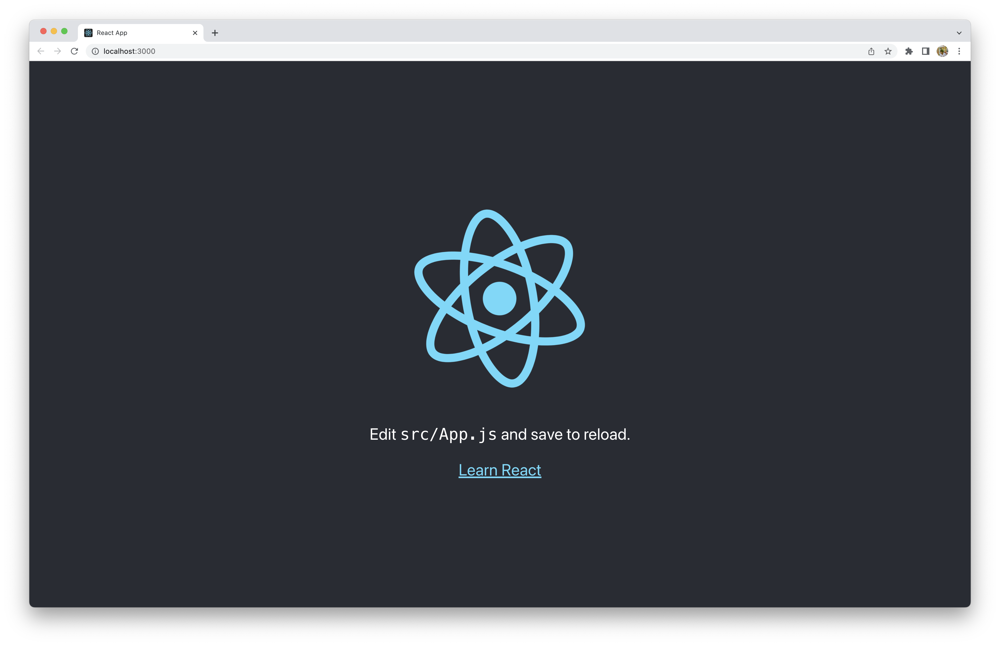

## Set AWS S3 bucket
Sign in an aws account and navigate to [S3 Dashboard](https://s3.console.aws.amazon.com/s3/home), then clicking **Create bucket**.

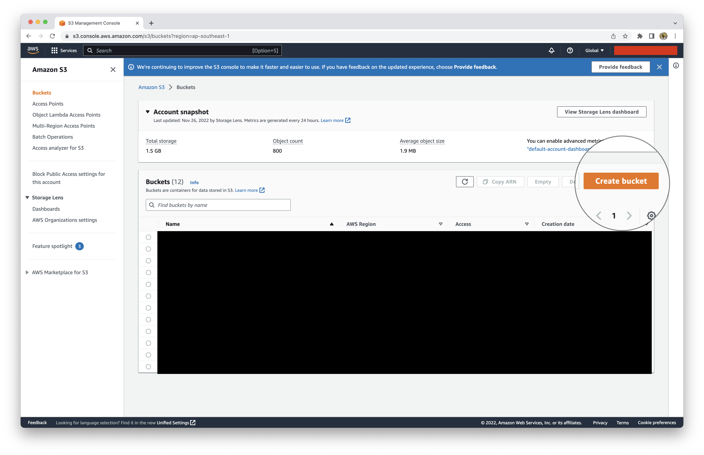

Change name of bucket and update **Block all public access**

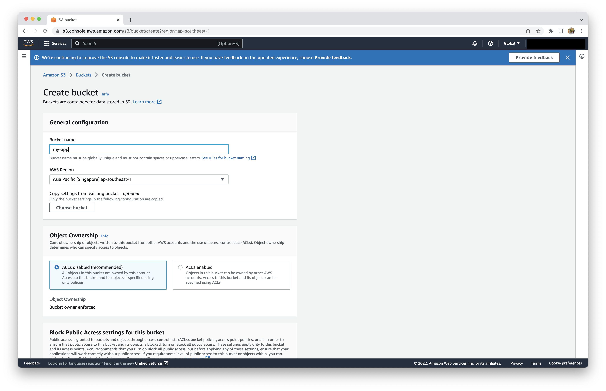

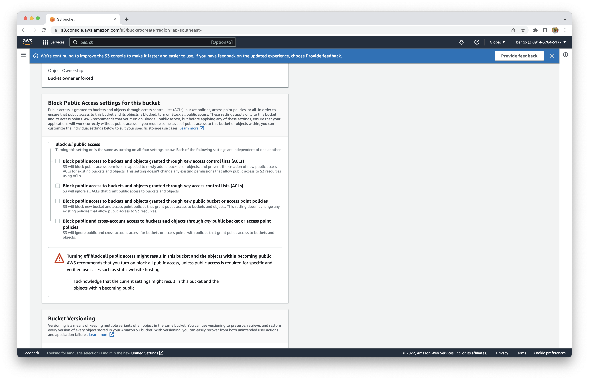

Click **Create bucket** button at the bottom, the bucket will be created. 

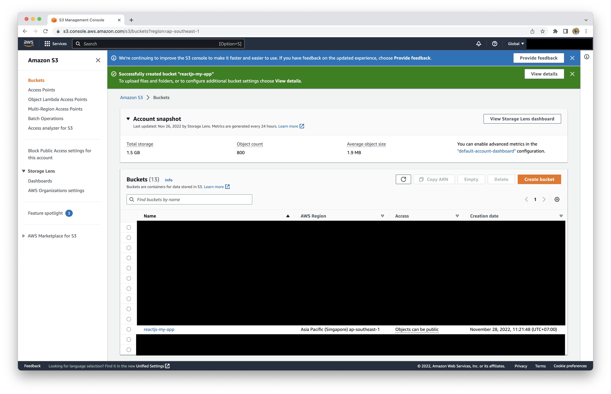

Navigate to bucket, go to properties tab of bucket, and update `Static website hosting`.

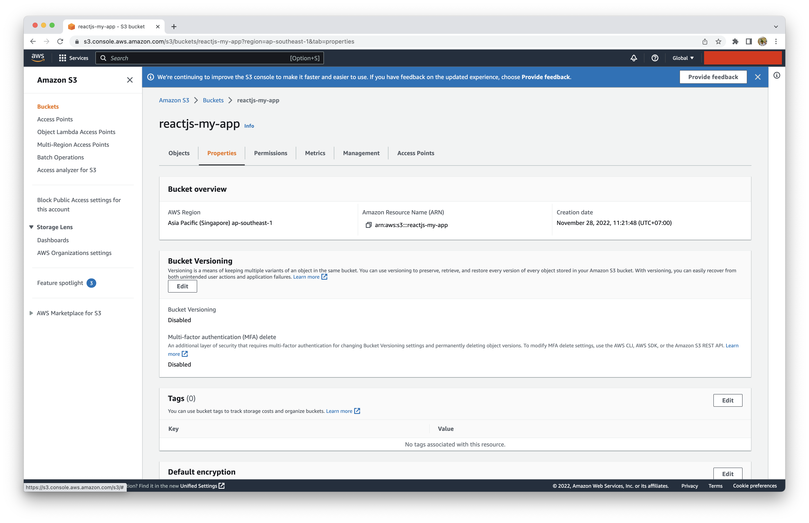

Scroll to bottom and click **Edit** button in **Static website hosting** section.

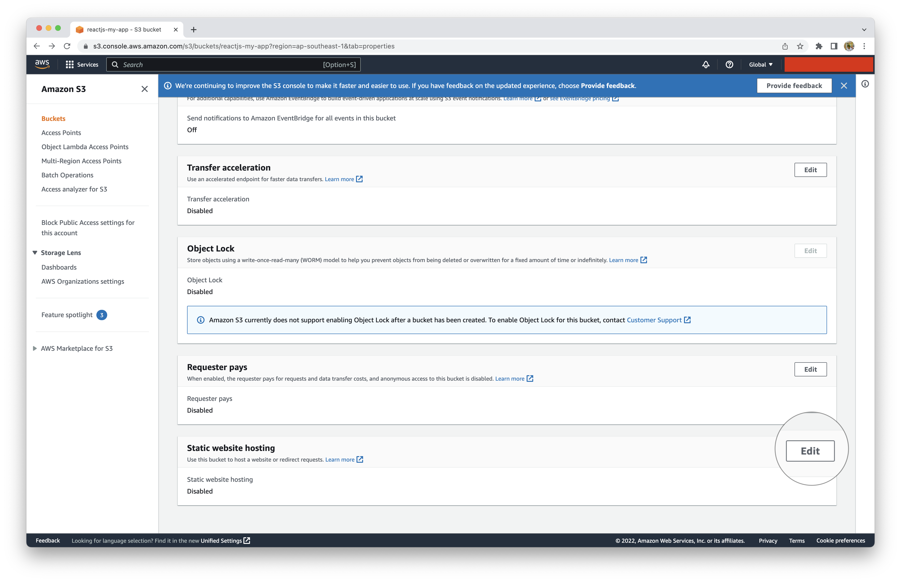

Check **Enabled** and update **Index document**, then clicking **Save changes** button.

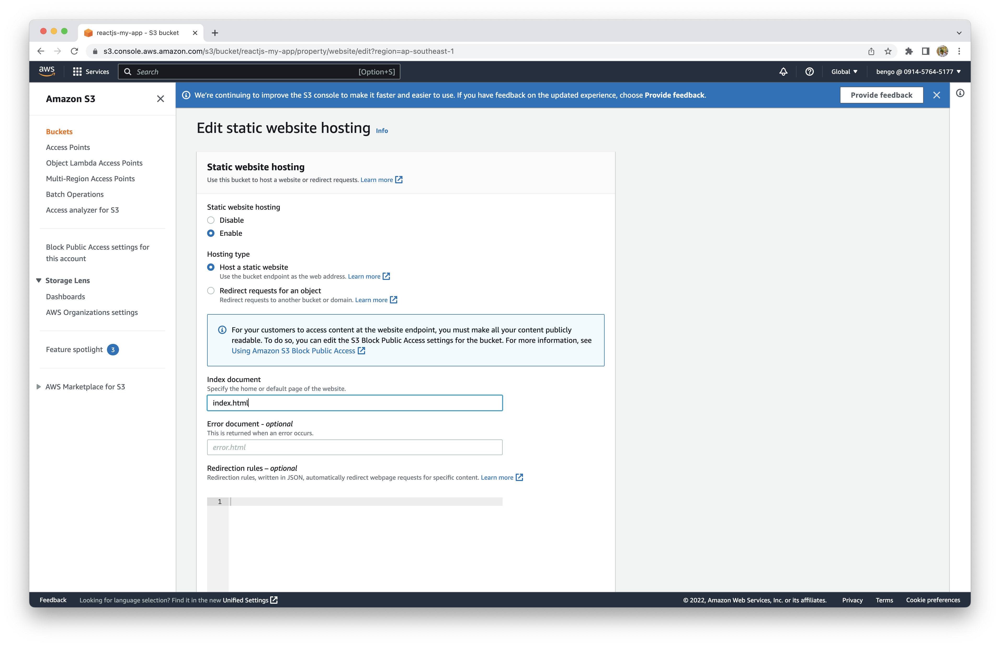

After editing successfully, we will have **Bucket website endpoint** being our website link. 

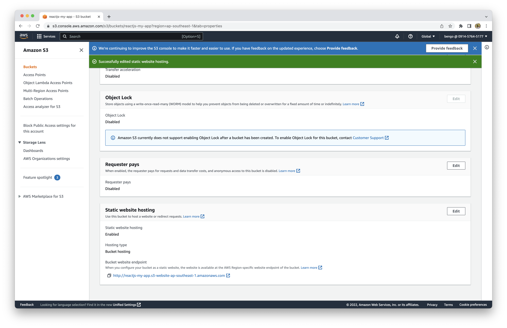

**Notes:** If we open now, it will throw error, so we need to update a **Bucket policy** before.

Go to permissions tab and click **Edit** button in **Bucket policy** section.

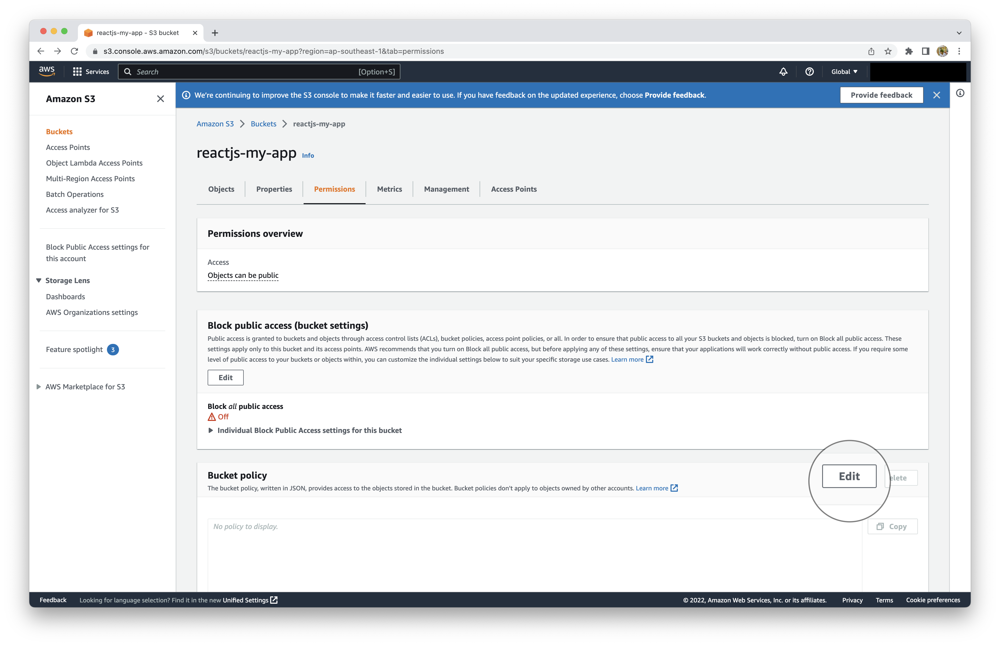

Please copy and change name value with the bucket ARN of your bucket.

```
{
    "Version": "2012-10-17",
    "Statement": [
        {
            "Sid": "PublicReadGetObject",
            "Effect": "Allow",
            "Principal": "*",
            "Action": "s3:GetObject",
            "Resource": "<value-with-the-bucket-ARN>/*"
        }
    ]
}
```

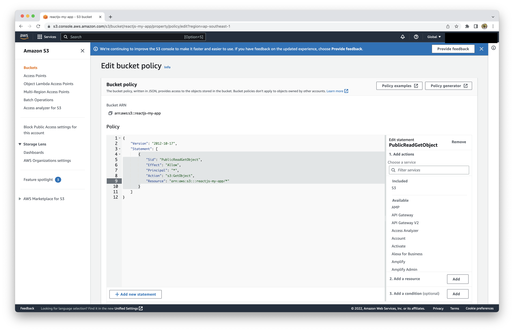

Now, click **Save changes** button, maybe everything is ready to upload ReactJS source to bucket.

## Deploy the ReactJS app to S3
Back to source code and run command.

```bash
yarn build or npm run build
```

We will have **build** folder.

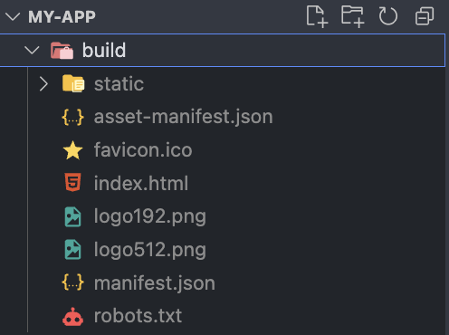

Now back to S3 Dashboard and click **Upload button**.


Uploading all file in **build** folder to here like below and clicking **Upload** button.

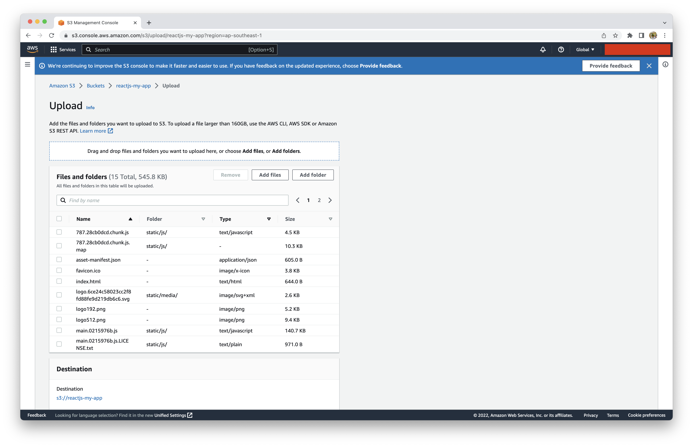

**Now, we can open the website again with the link in properties tab**

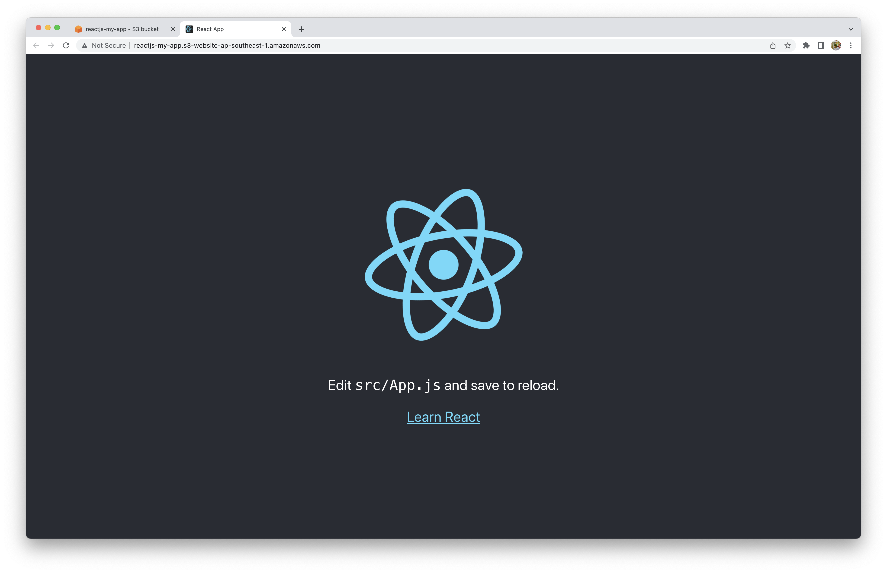

**Congratulation!!! 🥳🥳🥳**