# Security Group

## Why we need Security Group?
A security group controls the traffic that is allowed to reach and leave the resources that it is associated with. For example, after you associate a security group with an EC2 instance, it controls the inbound and outbound traffic for the instance.

For each security group, you add rules that control the traffic based on **protocols** and **port numbers**. There are separate sets of rules for inbound traffic and outbound traffic.

**Inbound** means incoming traffic coming to your EC2 instances (or your other resources).
**Outbound** means outgoing traffic from your EC2 instances (or your other resources).
For example, when you SSH to your EC2 instance (this is Inbound traffic) and you install some packages for that instance (this is Outbound traffic). This [example](https://stackoverflow.com/questions/68792117/outbound-rules-in-a-security-group) can help you more understand about inbound vs outbound.

## Security group basics
### Security groups
- Every VPC comes with a default Security Group and you can not delete that default Security Group. If you don't associate a security group when you create the resource, AWS automatically associates the default security group.
- Security groups are **stateful**. It means, if you send a request from an instance, the response traffic for that request is allowed to reach the instance regardless of the inbound security group rules. Responses to allowed inbound traffic are allowed to leave the instance, regardless of the outbound rules.
### Security group rules
- Security group rules are always permissive; you can't create rules that deny access.
- When you first create a security group, it has no inbound rules (so no inbound traffic is allowed) and it has an outbound rule that allows all outbound traffic.
- When you associate multiple security groups with an instance, the rules from each security group are effectively aggregated to create one set of rules. Amazon EC2 uses this set of rules to determine whether to allow access.
- Your changes (on Security group rules) are automatically applied to all resources associated with the security group.
- Each Security Group rule has
  - The **unique ID**: can be use for API or CLI
  - The **Protocol** to allow: TCP, UDP,...
  - The **Port range** to allow: can be a single port or a range of port
  - The **Source** (Inbound) or **Destination** (Outbound) for the traffic to allow. It can be a single IP address, a CIDR block, another Security Group or a Prefix List
  - The **Description** to help you identify it later. This is optional.

## Work with security groups
To work with Security Grooup, you can choose **Security Groups** in the navigation pane from [Amazon EC2 console](https://console.aws.amazon.com/ec2/) or [Amazon VPC console](https://console.aws.amazon.com/vpc/). 
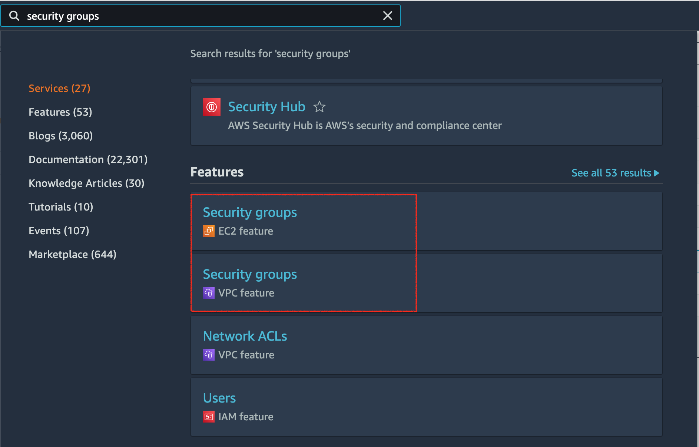In this example, I use EC2 management console.

### Create/Edit/Delete Security Group
Click **Create Security Group** on top-right corner, fill **Name**, **Description** and select a **VPC** from your VPC list.
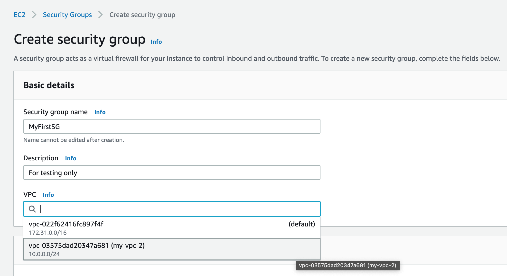

For now just let Inbound, Outbound rules as default.
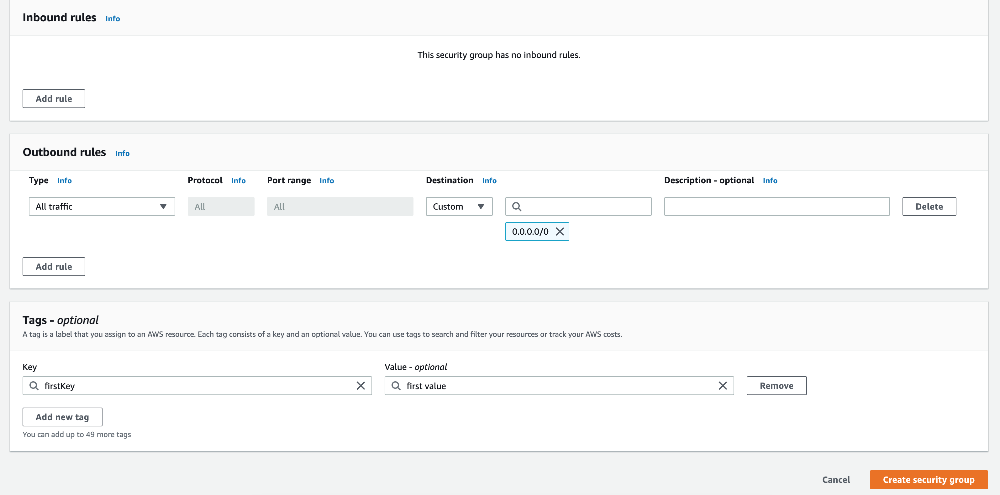

And click **Create Security Group** and you can see your security group.
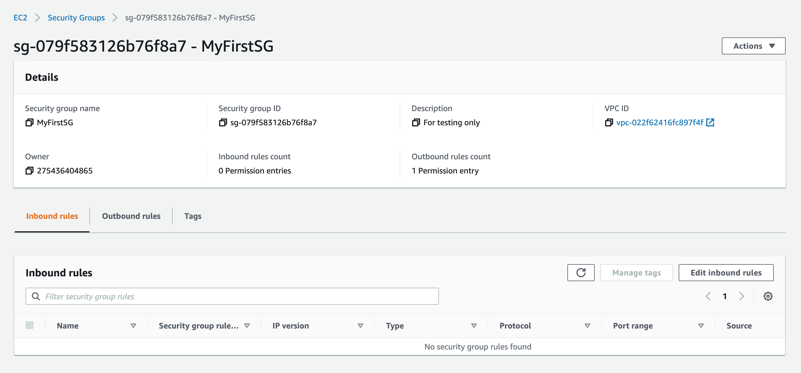

Click on **Action** button on top-right corner to see some actions we can do with this Security Group.
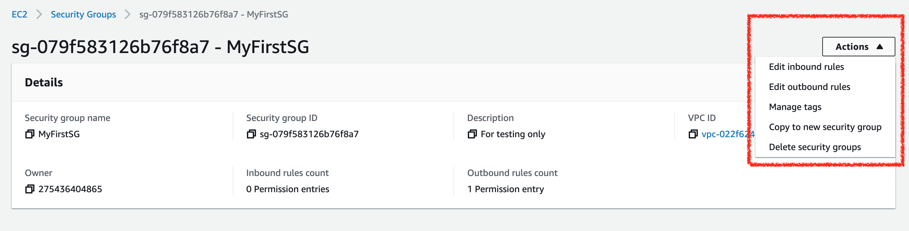

**Edit inbound/outbound rules** - we will work with this later. **Manage tags**, **copy** and **delete** Security Group - are basic actions, you can easily try it out. A note for **Delete** action: you can't delete a security group if it's the default security groups, referenced by other security groups, or they are associated with instances or network interfaces.
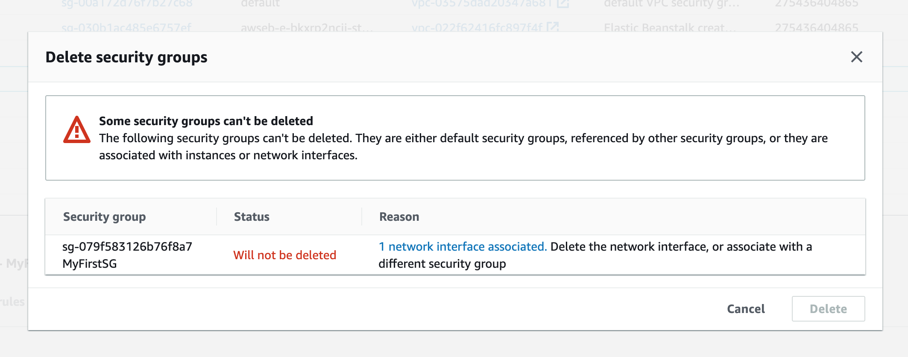

### Associtate Security Groups
To check how Security Group control the traffic, let's associate our security group with an EC2 instance. I assume that you have some basic knowledge about EC2 instance or you can check [this tutorial](https://github.com/GoldenOwlAsia/go-lnd/tree/main/deployment/aws/ec2).
In my EC2 instance detail page, I click on **Change Security Group** 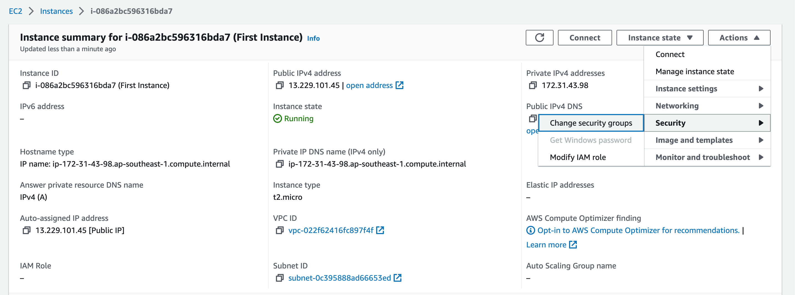

Remove all current Security Groups for the instance, add security group that we created in previous section and click on **Save**
Note: An instance can associate with many Security Groups, in this example we just associate with 1 security group to easily see how that security group control the traffic.
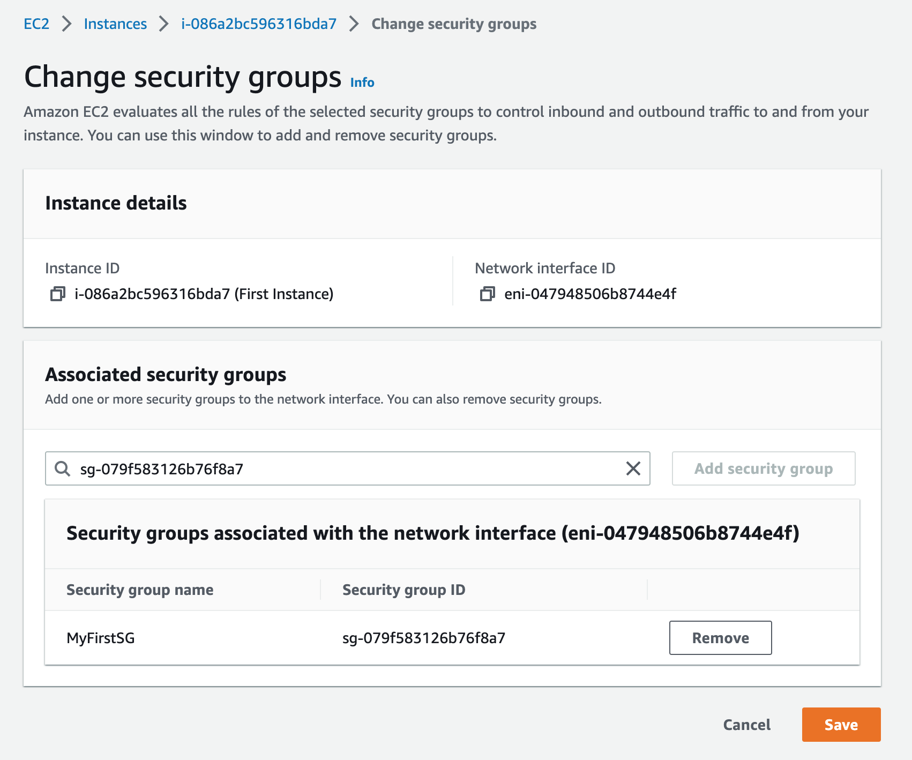

Check EC2 instance security group again
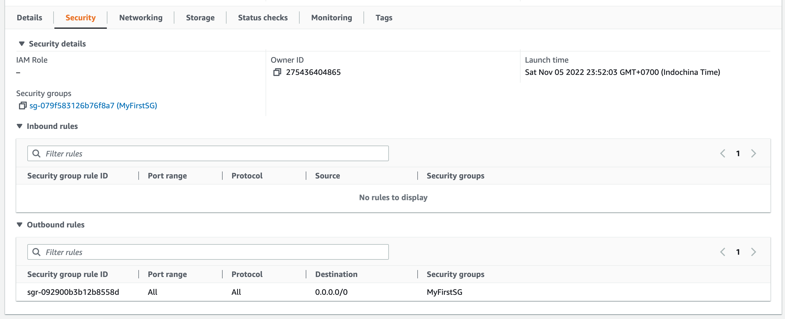

### Work with security group rules
#### Inbound rules
Since the Inbound rules empty, all incomming traffic will not allow to reach our instance. Check with SSH connection to the instance - it will be failed.
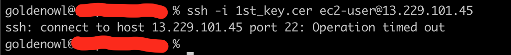

Let's **add an Inbound rule** to allow SSH connection. Click on **Edit Inbound rules** from our security group. Because SSH is an importance connection, so I just allow SSH from my IP address. Click **Save rules**
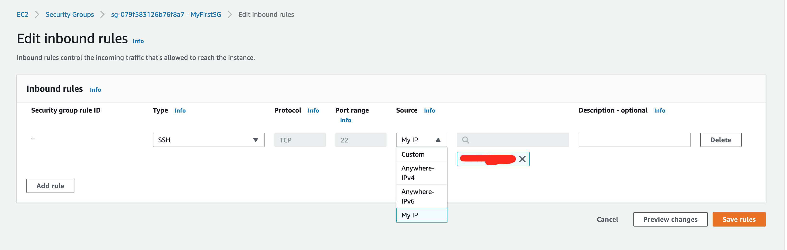

With the new rule was be added, now we can make a SSH connection to our EC2 instance.

That means Inbound rules work as expected.
#### Outbound rules
By default, our security group has an outbound rule that allows all outbound traffic from the instance - it means, we can make request to everywhere.
Let's try it by install some packages for our instance (when install a package, our instance will request to Package Manager server for package information - that **Outbound traffic**). I will install **git** for our EC2 instance.
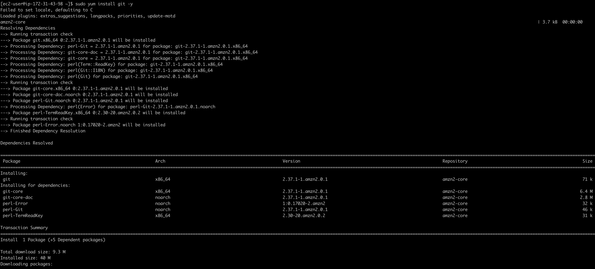

And now, we will delete that Outbound rules. Click on **Edit Outbound rules** from our security group, click **Delete** that outbound rule and **Save rules**
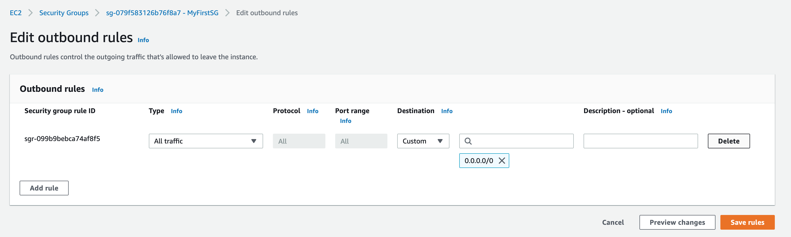
(Uninstall git first :)) And install **git** again, it will be failed!
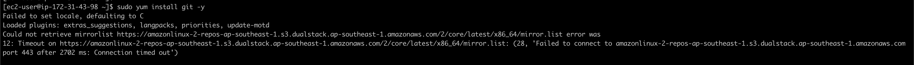
So Outbound rules work as expected too.

### Best practices (from AWS documents)
- Authorize only specific IAM principals to create and modify security groups.

- Create the minimum number of security groups that you need, to decrease the risk of error. Use each security group to manage access to resources that have similar functions and security requirements.

- When you add inbound rules for ports 22 (SSH) or 3389 (RDP) so that you can access your EC2 instances, authorize only specific IP address ranges. If you specify 0.0.0.0/0 (IPv4) and :: / (IPv6), this enables anyone to access your instances from any IP address using the specified protocol.

- Do not open large port ranges. Ensure that access through each port is restricted to the sources or destinations that require it.

- Consider creating network ACLs with rules similar to your security groups, to add an additional layer of security to your VPC. For more information about the differences between security groups and network ACLs, see Compare security groups and network ACLs.
