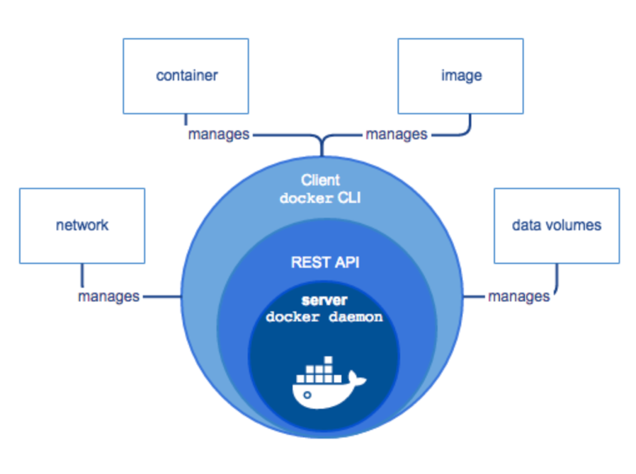
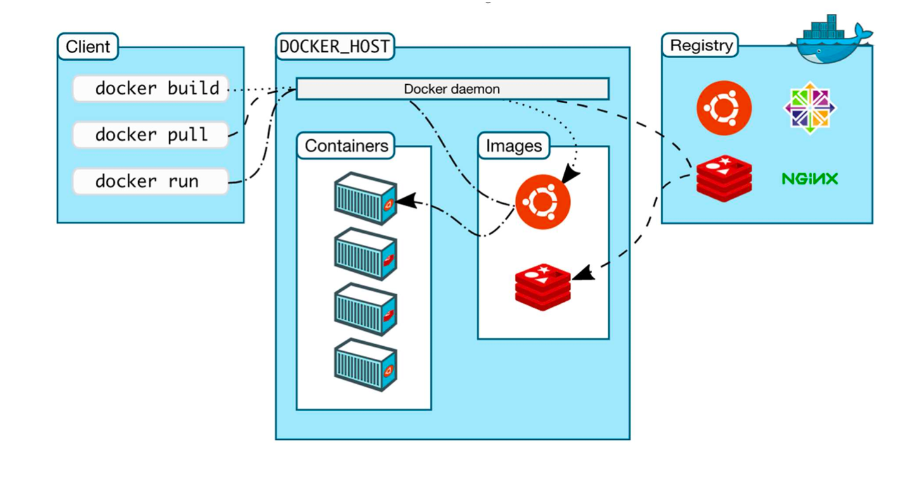

# Docker Introduction
Docker is one of the most popular tools for application containerization. Docker enables efficiency and reduces operational overheads so that any developer, in any dev environment, can build stable and reliable applications.

### Table of content
1. What is Docker?
2. Docker components
3. Basic commands

### What is Docker?
Wikipedia defines Docker as

> an open-source project that automates the deployment of software applications inside containers by providing an additional layer of abstraction and automation of OS-level virtualization on Linux.

In simpler words, Docker is a tool that allows developers, sys-admins etc. to easily deploy their applications in a sandbox (called containers) to run on the host operating system i.e. Linux. The key benefit of Docker is that it allows users to package an application with all of its dependencies into a standardized unit for software development. Unlike virtual machines, Docker containers offer:

- OS-level abstraction with optimum resource utilization
- Interoperability
- Efficient build and test
- Faster application execution

Fundamentally, Docker containers modularize an application’s functionality into multiple components that allow deploying, testing, or scaling them independently when needed.

Take, for instance, a Docker containerized database of an application. With such a framework, you can scale or maintain the database independently from other modules/components of the application without impacting the workloads of other critical systems.

### Docker components
Docker comprises the following different components within its core architecture:
- Images
- Containers
- Registries
- Docker Engine



#### Images
Images are like blueprints containing instructions for creating a Docker container. Images define:
- Application dependencies
- The processes that should run when the application launches

You can get images from DockerHub or create your own images by including specific instructions within a file called Dockerfile.

#### Containers
Containers are live instances of images on which an application or its independent modules are run.

In an object-oriented programming analogy, an image is a class and the container is an instance of that class. This allows operational efficiency by allowing to you to multiple containers from a single image.

#### Registries
A Docker registry is like a repository of images.

The default registry is the Docker Hub, a public registry that stores public and official images for different languages and platforms. By default, a request for an image from Docker is searched within the Docker Hub registry.

You can also own a private registry and configure it to be the default source of images for your custom requirements.

#### Docker Engine
The Docker Engine is of the core components of a Docker architecture on which the application runs. You could also consider the Docker Engine as the application that’s installed on the system that manages containers, images, and builds.

A Docker Engine uses a client-server architecture and consists of the following sub-components:

- **The Docker Daemon** is basically the server that runs on the host machine. It is responsible for building and managing Docker images.
- **The Docker Client** is a command-line interface (CLI) for sending instructions to the Docker Daemon using special Docker commands. Though a client can run on the host machine, it relies on Docker Engine’s REST API to connect remotely with the daemon.
- **A REST API** supports interactions between the client and the daemon.

### Basic commands
```
Docker <component> <command>
```
Where **<component>** could be:
- image
- container
- network
- volumne

and **<command>** could be:
- list
- run
- exec
- stop
- pull
- prune
- ...


