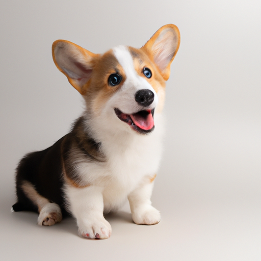
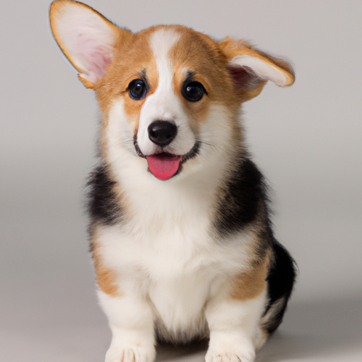
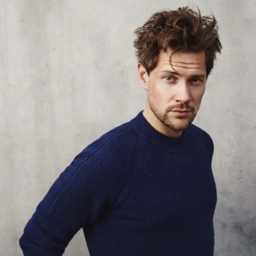
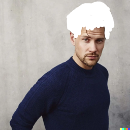
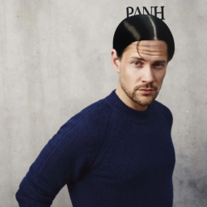
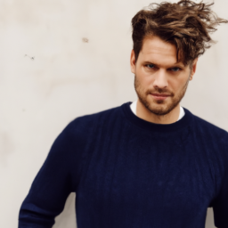
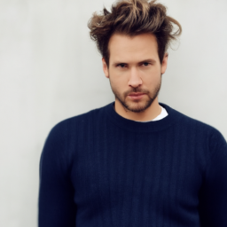

# DALL-E

## What is Dall-E?
DALL·E 2 is a new AI system that can create realistic images and art from a description in natural language.

## Dall-E features
- Create original, realistic images and art from a text description. It can combine concepts, attributes, and styles.
- Expand images beyond what’s in the original canvas, creating expansive new compositions.
- Make realistic edits to existing images from a natural language caption. It can add and remove elements while taking shadows, reflections, and textures into account.
- Take an image and create different variations of it inspired by the original.

## Dall-E API
To use Dall-E APIs (or OpenAI APIs), you need to have an OpenAI account and generate a key for authentication.

### Generations
Dall-E will generate images based on your descriptions.

```sh
curl https://api.openai.com/v1/images/generations \
  -H "Content-Type: application/json" \
  -H "Authorization: Bearer $OPENAI_API_KEY" \
  -d '{
    "prompt": "a photo of a happy corgi puppy sitting and facing forward, studio light, longshot",
    "n":2,
    "size":"512x512"
   }'
```
If your API calling success, it will response a list of generated image urls.
```sh
{
  "created": 1676815188,
  "data": [
    {
      "url": "https://oaidalleapiprodscus.blob.core.windows.net/private/org-tTlBZLnlMuawQJkweU49JJsP/user-J...."
    },
    {
      "url": "https://oaidalleapiprodscus.blob.core.windows.net/private/org-tTlBZLnlMuawQJkweU49JJsP/user-J...."
    }
  ]
}
```
Open the urls to see the result:
 
### Edits
To edit an image, we need to provide 2 images: an original image and an edited image

 
```sh
curl https://api.openai.com/v1/images/edits \
  -H "Authorization: Bearer $OPENAI_API_KEY" \
  -F image="@/Users/goldenowl/Downloads/original.png" \
  -F mask="@/Users/goldenowl/Downloads/edited.png" \
  -F prompt="Long black hair" \
  -F n=1 \
  -F size="256x256"
```

```sh
{
  "created": 1676543924,
  "data": [
    {
      "url": "https://oaidalleapiprodscus.blob.core.windows.net/private/org-tTlBZLnlMuawQJkweU49JJsP/user-J...."
    }
  ]
}
```
Check the result image, Dall-E changed his hair as our descriptions:


### Variations
This API will create different variations of it inspired by your provided image.
```sh
curl https://api.openai.com/v1/images/variations \
  -H "Authorization: Bearer $OPENAI_API_KEY" \
  -F image="@/Users/goldenowl/Downloads/original.png" \
  -F n=2 \
  -F size="256x256"
```
```sh
{
  "created": 1676544463,
  "data": [
    {
      "url": "https://oaidalleapiprodscus.blob.core.windows.net/private/org-tTlBZLnlMuawQJkweU49JJsP/user-J...."
    },
    {
      "url": "https://oaidalleapiprodscus.blob.core.windows.net/private/org-tTlBZLnlMuawQJkweU49JJsP/user-J...."
    }
  ]
}
```
 

## Dall-E with Ruby

### Ruby-OpenAI gem
As it's name, ```ruby-openai``` gem not only for Dall-E APIs, it's also support other OpenAI APIs, read more about this gem in it's [document](https://github.com/alexrudall/ruby-openai).
Add ```OPENAI_API_KEY``` and ```OPENAI_ORGANIZATION_ID``` to ```openai.rb``` initializer file.
```sh
  OpenAI.configure do |config|
      config.access_token = ENV.fetch('OPENAI_API_KEY')
      config.organization_id = ENV.fetch('OPENAI_ORGANIZATION_ID') # Optional.
  end
```
And create a client by
```sh
  client = OpenAI::Client.new
```

You can use that client to call OpenAI API (instead of ```curl```)

###### Generate images
```sh
  response = client.images.generate(parameters: { prompt: "A baby sea otter cooking pasta wearing a hat of some sort", size: "256x256" })
  puts response.dig("data", 0, "url")
```

###### Edit images
```sh
  response = client.images.edit(parameters: { prompt: "A solid red Ruby on a blue background", image: "image.png", mask: "mask.png" })
  puts response.dig("data", 0, "url")
```

###### Image variations
```sh
  response = client.images.variations(parameters: { image: "image.png", n: 2 })
  puts response.dig("data", 0, "url")
```
