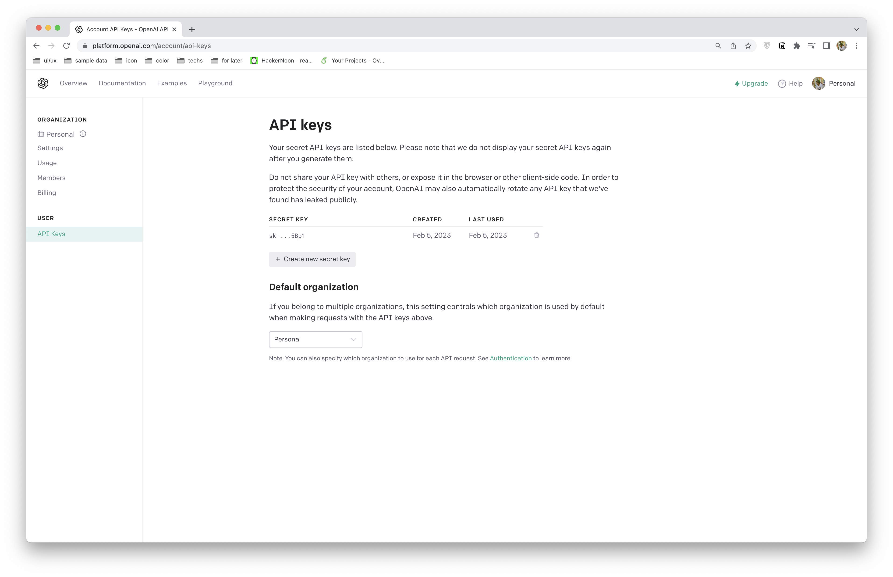
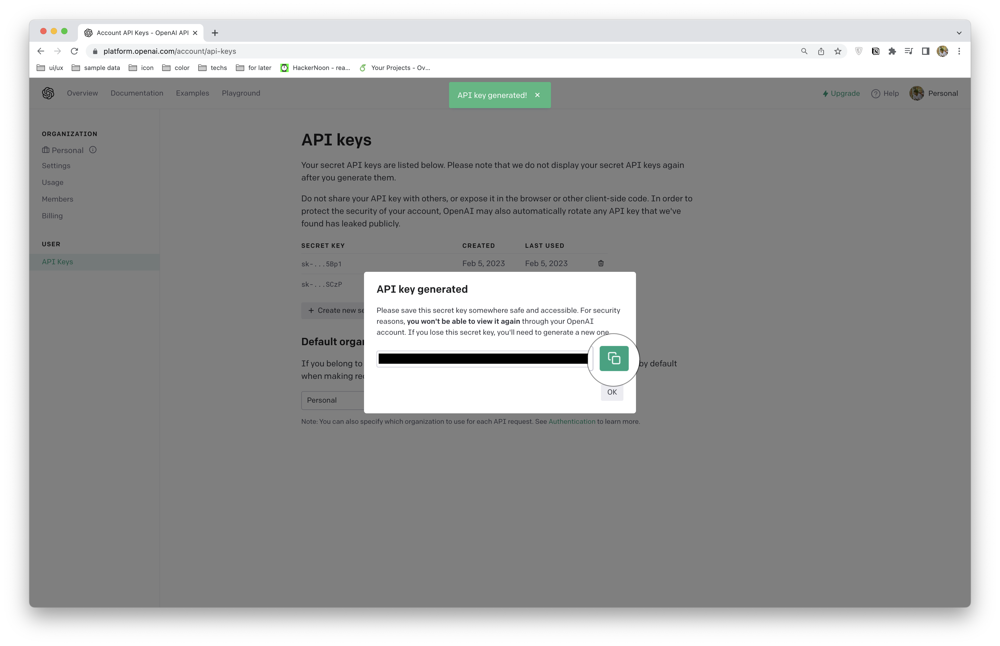

# OpenAI Text Completion and Code Completion - NodeJS Example App
### Table of Contents
- [Intro](#intro)
  - [Text completion](#text-completion)
  - [Code completion](#code-completion)
- [NodeJS example app](#nodejs-example-app)

## Intro

#### Text completion
When you input some text, the model will return a text completion. 

If you provide the complexity of the task and quality of your text that is enough good, you will receive an answer more exactly. 

Moreover, the model will return different results even if you send the same text.

#### Code completion
We can only type input with natural language, It will return code to help me solve the problem.

If we give it a specific problem, It will return a result better. It can code in dozen programming languages like Python, JavaScript, Go, Perl, PHP, Ruby, Swift, TypeScript, SQL, and even Shell. But the best language is Python.

## OpenAI on NodeJS App
**Note:** We only use OpenAI for server-side, if not it will expose your secret API key.

#### Generate secret API key
  **Note:** You must have an OpenAI account and access to `API keys`
  
  

  - Press `Create new secret key` button and press `Copy` the API key
  
  

  Now you had **the secret API key**.

#### Run OpenAI on Node app
- Setup env and others
  - Install [openai](https://www.npmjs.com/package/openai)

  ```bash
  yarn add openai
  ```

  - Install [dotenv](https://www.npmjs.com/package/dotenv) and add `.gitignore` file 

  **Note:** Avoid exposing the secret keys when pushing the source code to git.

  ```bash
  yarn add dotenv --dev
  ```

  - Create file `src/index.js` and run this file. 
  **Note:** Remember to add the secret API key to `.env` file. Besides, remember the `model` of `text completion` is different from the `model` of `code completion`.

  ```ts
  import * as dotenv from "dotenv";
  import { Configuration, OpenAIApi } from "openai";

  import type { CreateCompletionRequest } from "openai";

  dotenv.config();

  const configuration = new Configuration({
    apiKey: process.env.OPENAI_API_KEY,
  });
  const openai = new OpenAIApi(configuration);

  const textCompletionRequest: CreateCompletionRequest = {
    model: "text-davinci-003",
    prompt: "How to become a good person?",
    temperature: 0,
    max_tokens: 3999,
    top_p: 1,
    frequency_penalty: 0.0,
    presence_penalty: 0.0,
  };

  const codeCompletionRequest: CreateCompletionRequest = {
    model: "code-davinci-002",
    prompt: "Sum two numbers in JS?",
    temperature: 0,
    max_tokens: 2047,
    top_p: 1,
    frequency_penalty: 0.0,
    presence_penalty: 0.0,
  };

  openai
    .createCompletion(textCompletionRequest)
    .then((res) => console.log("Response text:", res.data.choices[0].text))
    .catch((error) => console.error("Error:", error));

  openai
    .createCompletion(codeCompletionRequest)
    .then((res) => console.log("Response code:", res.data.choices[0].text))
    .catch((error) => console.error("Error:", error));

  ```

**After that, Congrats! The OpenAI is being run on NodeJS App. 🥳🥳🥳**