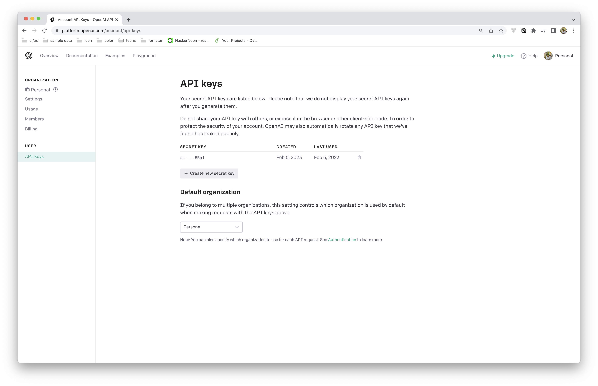

# OpenAI Text Completion - NodeJS Example App
### Table of Contents
- [Intro](#intro)
- [NodeJS example app](#nodejs-example-app)

## Intro

## OpenAI on NodeJS App
**Note:** We only use OpenAI for server-side, if not it will expose your secret API key.

#### Generate secret API key
**Note:** You must have an OpenAI account and access to `API keys`


- Press `Create new secret key` button and press `Copy` the API key


Now you had the secret API key.

#### Run OpenAI on Node app
- Setup env and others
  - Install [openai](https://www.npmjs.com/package/openai)

  ```bash
  yarn add openai
  ```

  - Install [dotenv](https://www.npmjs.com/package/dotenv) and add `.gitignore` file 

  **Note:** Avoid exposing the secret keys when pushing the source code to git.

  ```bash
  yarn add dotenv --dev
  ```

  - Create file `src/index.js` and run this file. 
  **Note:** Remember to add the secret API key to `.env` file

  ```ts
  import * as dotenv from 'dotenv' 

  dotenv.config()

  import { Configuration, OpenAIApi } from "openai";

  const configuration = new Configuration({
    apiKey: process.env.OPENAI_API_KEY,
  });

  const openai = new OpenAIApi(configuration);

  openai
    .createCompletion({
      model: "text-davinci-003",
      prompt: "Write an email to a colleague named Jill congratulating her on her promotion. The tone should be warm yet professional. Mention how you admire the work she's been putting in.  Include a joke about how her pet lizard Max enjoys eating grasshoppers. Mention how you're looking forward to the team off-site next week.",
      max_tokens: 1000
    })
    .then((res) => console.log("data", res.data.choices[0].text));
  ```

**After that, Congrats! The OpenAI is being run on NodeJS App. 🥳🥳🥳**